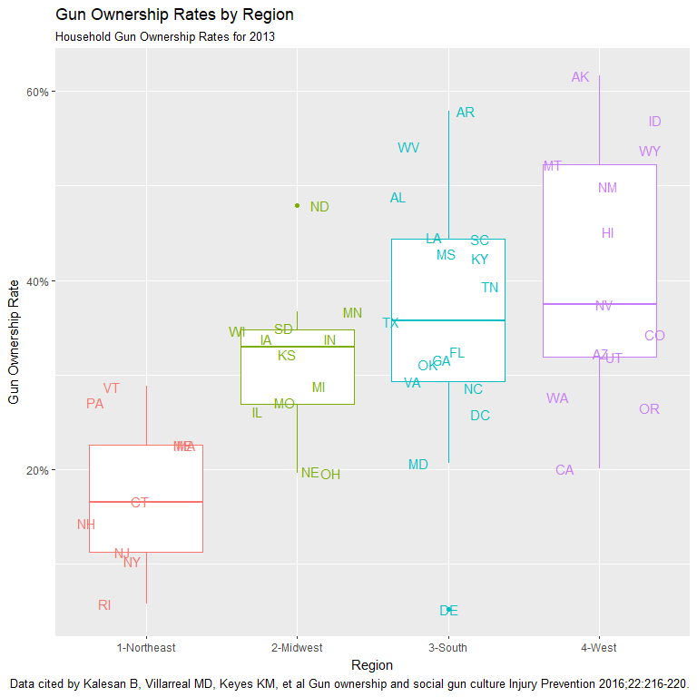
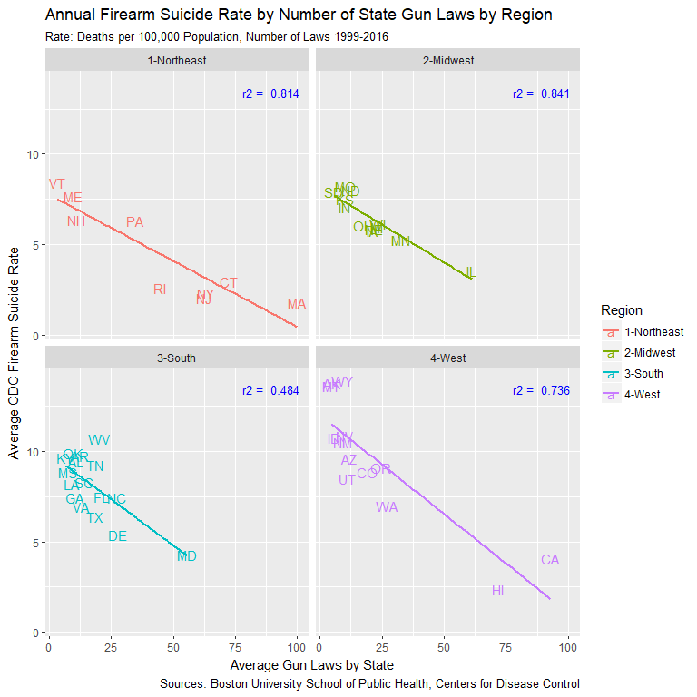
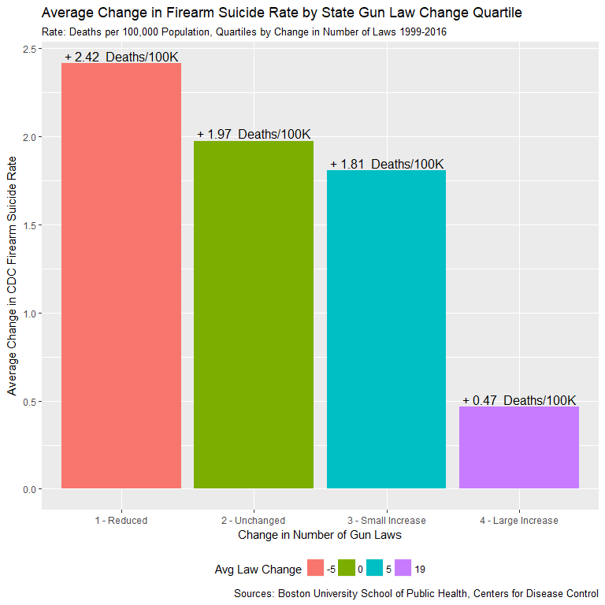
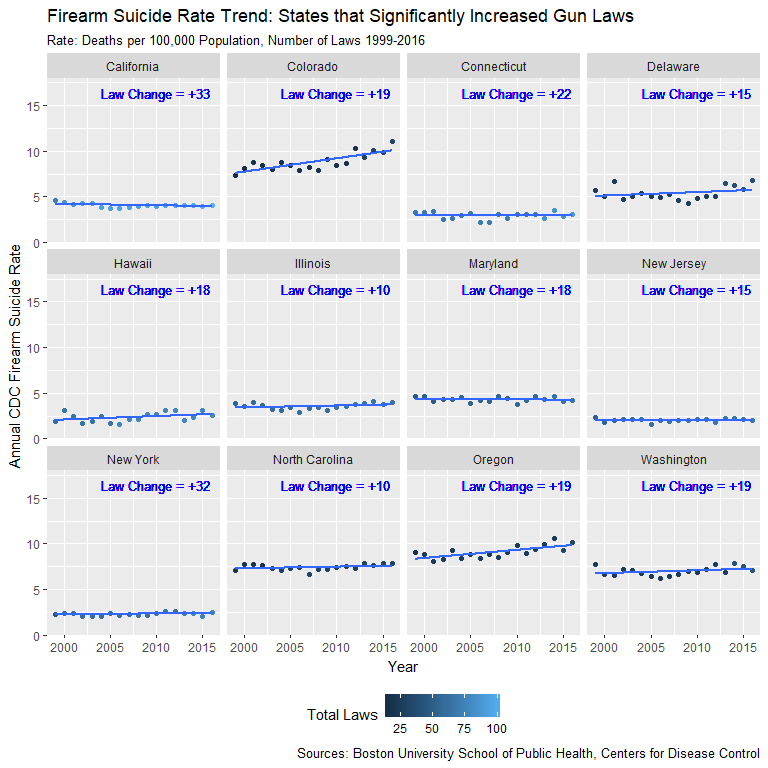

Statistical Analysis Summary
================
Jim Scotland
March 11, 2018

### CDC Firearm Homicide & Suicide Data

#### Plot total numbers of Firearm Suicides & Homicides to highlight problem at the start.

``` r
gun_deaths_df %>%
  group_by(year) %>%
  summarise(Homicide = sum(hom_cnt), Suicide = sum(sui_cnt)) %>%
  gather(key = "Firearm_Death", value = "Deaths", c(Homicide, Suicide)) %>%
  ggplot(aes(x = year, y = Deaths, color = Firearm_Death)) +
  geom_line(size = 1.5) +
  expand_limits(y = 0) +
  scale_y_continuous(labels = comma) +
  ylab("Annual CDC Firearm Fatality Totals") +
  xlab("Year") +
  labs(color = "Firearm Deaths") +
  labs(title = "CDC Annual Firearm Deaths, Homicide vs Suicide", 
       subtitle = "National Totals 1999-2016") +
  labs(caption = "Centers for Disease Control Data for 1999-2016") +
  theme(legend.position = "right")
```


##### Total firearm suicides far exceed firearm homicides and have climbed steadily since around 2006 to a total of just under 23,000.

#### Basic statistical summary for Firearm Homicide rates for 1999-2016

``` r
gun_deaths_df %>%
  ungroup(state) %>%
  summarize(N = n(), Min = min(hom_rate), Max = max(hom_rate), Avg = mean(hom_rate), 
            Median = median(hom_rate), IQR = IQR(hom_rate), SD = sd(hom_rate))
```

    ## # A tibble: 1 x 7
    ##       N   Min   Max   Avg Median   IQR    SD
    ##   <int> <dbl> <dbl> <dbl>  <dbl> <dbl> <dbl>
    ## 1   918 0.600  30.7  3.74   3.30  3.00  3.11

##### Max of 30.7 stems from exceedingly high DC rates noted on import, will filter out DC for plots to avoid skewing of y-axis.

#### Same summary for Firearm Suicide rates

``` r
gun_deaths_df %>%
  ungroup(state) %>%
  summarize(N = n(), Min = min(sui_rate), Max = max(sui_rate), Avg = mean(sui_rate), 
            Median = median(sui_rate), IQR = IQR(sui_rate), SD = sd(sui_rate))
```

    ## # A tibble: 1 x 7
    ##       N   Min   Max   Avg Median   IQR    SD
    ##   <int> <dbl> <dbl> <dbl>  <dbl> <dbl> <dbl>
    ## 1   918  1.10  17.7  7.30   7.40  3.88  3.11

##### Average firearm suicide rate is nearly 2X the average firearm homicide rate.

#### Run correlation on Homicide vs Suicide to check for linear relationship.

``` r
gun_deaths_df %>%
  left_join(regions_df, by = "state") %>%
  filter(usps_st != "DC") %>%
  ungroup(state) %>%
  summarize(N = n(), cor = cor(sui_rate, hom_rate))
```

    ## # A tibble: 1 x 2
    ##       N   cor
    ##   <int> <dbl>
    ## 1   900 0.130

##### Correlation of 0.13, minimal relationship between homicide and suicide rates.

#### State level Suicide Rate vs Homicide Rate

``` r
gun_deaths_df %>%
  left_join(regions_df, by = "state") %>%
  filter(usps_st != "DC") %>%
  group_by(region, usps_st) %>%
  summarise(hom_rate = mean(hom_rate), sui_rate = mean(sui_rate)) %>%
  ggplot(aes(x = hom_rate, y = sui_rate, color = region, label = usps_st)) +
  geom_text() +
  stat_smooth(method = "lm", se = FALSE, color = "blue") +
  expand_limits(y = 0, x = 0) +
  geom_vline(linetype = 2, color = "red", xintercept = 3.75) +
  geom_hline(linetype = 2, color = "red", yintercept = 7.50) +
  labs(color = "Region") +
  ylab("Average CDC Firearm Suicide Rate") +
  xlab("Average CDC Firearm Homicide Rate") +
  labs(title = "Firearm Suicide Rates by Firearm Homicide Rates", 
       subtitle = "Rate: Deaths per 100,000 Population") +
  labs(caption = "Centers for Disease Control Data for 1999-2016; DC excluded to avoid skewing of scale.") +
  theme(legend.position = "right")
```


##### Plot confirms lack of relation and reveals highest homicide rates in the South (LA, MS and AL), highest suicide rates in the West (WY, MT and AK) and large clusters of low rates for both in the Northeast (MA, CT, RI, NY and NJ).

#### State level "Suicide Rate - Homicide Rate" by Region

``` r
gun_deaths_df %>%
  left_join(regions_df, by = "state") %>%
  filter(usps_st != "DC") %>%
  group_by(region, usps_st) %>%
  summarise(Avg_Suicide_Rate = mean(sui_rate), Avg_Homicide_Rate = mean(hom_rate),
            Suicide_Homicide_Diff = Avg_Suicide_Rate - Avg_Homicide_Rate) %>%
  arrange(desc(Suicide_Homicide_Diff), desc(usps_st)) %>%
  select(region, usps_st, Suicide_Homicide_Diff) %>%
  ggplot(aes(x = reorder(usps_st, -Suicide_Homicide_Diff), y = Suicide_Homicide_Diff, fill = region)) +
  geom_bar(stat = "identity") +
  coord_flip() +
  facet_wrap(~ region, scales = "free_y") +
  labs(color = "Region") +
  ylab("Avg Firearm Suicide Rate Minus Avg Firearm Homicide Rate") +
  xlab("State") +
  labs(title = "Assessing the Greater Gun Threat: Firearm Suicides vs Firearm Homicides", 
       subtitle = "Bars Indicate Amount by which Suicide Rate Exceeds Homicide Rate") +
  labs(caption = "Centers for Disease Control Data for 1999-2016; DC excluded to avoid skewing of scale.") +
  theme(legend.position = "none")
```


##### Firearm homicide rates exceed firearm suicide rates in only 6 of 50 states. The largest rate differentials appear in several western states, suggesting regional influences. Turn focus to firearm suicides only.

#### Create table distinguishing gun suicides vs other suicides

``` r
sui_method_df <- all_suicides_df %>%
  left_join(gun_deaths_df, by = join_key) %>%
  select(state, year, pop, all_cnt = all_sui_cnt, all_rate = all_sui_rate, 
         gun_cnt = sui_cnt, gun_rate = sui_rate) %>%
  mutate(gun_pct = gun_cnt/all_cnt, 
         other_cnt = all_cnt - gun_cnt, 
         other_rate = all_rate - gun_rate)
summary(sui_method_df)
```

    ##     state                year           pop              all_cnt    
    ##  Length:918         Min.   :1999   Min.   :  491780   Min.   :  23  
    ##  Class :character   1st Qu.:2003   1st Qu.: 1599936   1st Qu.: 231  
    ##  Mode  :character   Median :2008   Median : 4131636   Median : 522  
    ##                     Mean   :2008   Mean   : 5922119   Mean   : 707  
    ##                     3rd Qu.:2012   3rd Qu.: 6696946   3rd Qu.: 918  
    ##                     Max.   :2016   Max.   :39250017   Max.   :4279  
    ##     all_rate       gun_cnt        gun_rate        gun_pct     
    ##  Min.   : 4.0   Min.   :  10   Min.   : 1.10   Min.   :0.143  
    ##  1st Qu.:10.8   1st Qu.: 113   1st Qu.: 5.42   1st Qu.:0.475  
    ##  Median :13.0   Median : 282   Median : 7.40   Median :0.539  
    ##  Mean   :13.4   Mean   : 367   Mean   : 7.30   Mean   :0.525  
    ##  3rd Qu.:15.5   3rd Qu.: 487   3rd Qu.: 9.30   3rd Qu.:0.613  
    ##  Max.   :29.7   Max.   :2016   Max.   :17.70   Max.   :0.803  
    ##    other_cnt      other_rate   
    ##  Min.   :  11   Min.   : 1.90  
    ##  1st Qu.: 100   1st Qu.: 4.90  
    ##  Median : 228   Median : 6.00  
    ##  Mean   : 340   Mean   : 6.13  
    ##  3rd Qu.: 416   3rd Qu.: 7.10  
    ##  Max.   :2684   Max.   :12.50

##### Table reveals wildly disparate data across all categories. Investigate on subregion level per indications from plot above.

#### Boxplot OVERALL Suicide Rates Across Subregions

``` r
sui_method_df %>%
  left_join(regions_df, by = "state") %>%
  group_by(subregion, year) %>%
  summarise(all_rate = sum(all_cnt)/sum(pop) * 100000,
            gun_rate = sum(gun_cnt)/sum(pop) * 100000,
            other_rate = sum(other_cnt)/sum(pop) * 100000) %>%
  ggplot(aes(x = subregion, y = all_rate, color = subregion)) +
  geom_boxplot() +
  ylab("CDC Overall Suicide Rate") +
  xlab("Year") +
  labs(title = "Regional Suicide Rates ALL Methods", 
       subtitle = "Rate: Deaths per 100,000 Population") +
  labs(caption = "Centers for Disease Control Data for 1999-2016") +
  theme(legend.position = "right") +
  theme(axis.text.x = element_text(angle = 45, vjust = 1, hjust = 1))
```


##### Coastal states have lower overall suicide rates, with the mountain region much higher which may be a partial result of significantly lower overall population levels.

#### Boxplot of OVERALL State Suicide Rates Grouped by Population Quartile

``` r
pop_labels <- c(
      '1' = "Low Population",
      '2' = "Moderate Low Population",
      '3' = "Moderate High Population",
      '4' = "High Population"
)

sui_method_df %>%
  left_join(regions_df, by = "state") %>%
  group_by(subregion, usps_st, year) %>%
  summarise(all_rate = sum(all_cnt)/sum(pop) * 100000,
            gun_rate = sum(gun_cnt)/sum(pop) * 100000,
            other_rate = sum(other_cnt)/sum(pop) * 100000,
            avg_suicides = mean(all_cnt),
            avg_pop = mean(pop)) %>%
  ggplot(aes(x = reorder(usps_st, -all_rate), y = all_rate, fill = subregion)) +
  geom_boxplot() +
  facet_wrap(~ ntile(avg_pop, 4), scales = "free_x", labeller = as_labeller(pop_labels)) +
  labs(fill = "Subregion") +
  ylab("CDC Overall Suicide Rate") +
  xlab("State") +
  labs(title = "Overall Suicide Rates by State Grouped by Population Quantile", 
       subtitle = "Rate: Deaths per 100,000 Population") +
  labs(caption = "Centers for Disease Control Data for 1999-2016") +
  theme(legend.position = "right")
```


##### Plot dispels issues of small population Mountain states driving higher suicide rates. Mountain states post highest overall suicide rates across all four population quartiles.

#### Lineplot of Suicide Rates by Method Across Subregions

``` r
sui_method_df %>%
  left_join(regions_df, by = "state") %>%
  group_by(subregion, year) %>%
  summarise(all_rate = sum(all_cnt)/sum(pop) * 100000,
            gun_rate = sum(gun_cnt)/sum(pop) * 100000,
            other_rate = sum(other_cnt)/sum(pop) * 100000) %>%
  gather(key = "Method", value = "rate", c(other_rate, gun_rate))  %>%
    ggplot(aes(x = year, y = rate, color = Method)) +
    geom_line(size = 1) +
    facet_wrap(~ subregion) +
    expand_limits(y = 0) +
    ylab("CDC Suicide Rates, Firearm & Other") +
    xlab("Year") +
    labs(title = "Regional Suicide Rates by Firearm vs Other Methods", 
         subtitle = "Rate: Deaths per 100,000 Population") +
    labs(caption = "Centers for Disease Control Data for 1999-2016") +
    theme(legend.position = "right")
```


##### Time series plot of suicides broken out by firearm/other indicates major regional differences. Coastal states exhibit much lower firearm rates at levels that appear more steady compared to other methods and other states.

#### Many-Mini Plot of Suicide Rates by Method at State Level

``` r
sui_method_df %>%
  left_join(regions_df, by = "state") %>%
  group_by(state, year) %>%
  summarise(all_rate = sum(all_cnt)/sum(pop) * 100000,
            gun_rate = sum(gun_cnt)/sum(pop) * 100000,
            other_rate = sum(other_cnt)/sum(pop) * 100000) %>%
  gather(key = "Method", value = "rate", c(other_rate, gun_rate))  %>%
  ggplot(aes(x = year, y = rate, color = Method)) +
  geom_line(size = 1) +
  facet_wrap(~ state) +
  ylab("CDC Suicide Rates, Firearm & Other") +
  xlab("Year") +
  labs(title = "State Level Suicide Rates by Firearm vs Other Methods", 
       subtitle = "Rate: Deaths per 100,000 Population, 1999-2016") +
  labs(caption = "Centers for Disease Control Data for 1999-2016") +
  theme(legend.position = "bottom") +
  theme(axis.title.x=element_blank(),
        axis.ticks.x=element_blank(),
        axis.text.x=element_blank())
```


##### Displays variation by state with large variations in small population states jumping out.

#### Partition States into Above/Below Average Suicide Rate, Calculate Percentage Using Firearm

    ## # A tibble: 2 x 4
    ##   abv_avg_rate     n deaths avg_gun_pct
    ##   <lgl>        <int>  <int>       <dbl>
    ## 1 F              503 424349       0.479
    ## 2 T              415 224424       0.582

##### Since 1999, guns accounted for an average 58% of suicides in states with above average suicide rates and 48% of suicides in states with below average rates (average rates calculated annually).

### Gun Ownership Rates

#### Statistical Summary of National Gun Ownerhip Rates

    ## # A tibble: 1 x 7
    ##       N    Min   Max   Avg Median   IQR    SD
    ##   <int>  <dbl> <dbl> <dbl>  <dbl> <dbl> <dbl>
    ## 1    51 0.0520 0.617 0.330  0.322 0.165 0.134

##### Average ownership rate of 33% ranging from 5% to 61.7%.

#### Summary at Regional Level

    ## # A tibble: 4 x 8
    ##   region          N    Min   Max   Avg Median    IQR     SD
    ##   <chr>       <int>  <dbl> <dbl> <dbl>  <dbl>  <dbl>  <dbl>
    ## 1 1-Northeast     9 0.0580 0.288 0.177  0.166 0.113  0.0798
    ## 2 2-Midwest      12 0.196  0.479 0.313  0.330 0.0790 0.0776
    ## 3 3-South        17 0.0520 0.579 0.362  0.357 0.151  0.129 
    ## 4 4-West         13 0.201  0.617 0.408  0.375 0.204  0.132

##### Below average rates in Northeast, above average in West and South - regional dynamic again.

#### Boxplot of Ownership Rates by Region

``` r
gun_own_2013_df %>%
  left_join(regions_df, by = "state") %>%
  ggplot(aes(x = region, y = own_rate, color = region, label = usps_st)) +
  geom_boxplot() +
  geom_text(position = "jitter") +
  scale_y_continuous(labels = function(x) paste0(x*100, "%")) +
  labs(color = "Region") +
  ylab("Gun Ownership Rate") +
  xlab("Region") +
  labs(title = "Gun Ownership Rates by Region", 
       subtitle = "Household Gun Ownership Rates for 2013") +
  labs(caption = "Data cited by Kalesan B, Villarreal MD, Keyes KM, et al Gun ownership and social gun culture Injury Prevention 2016;22:216-220.") +
  theme(legend.position = "none")
```



### Gun Ownership Rates vs CDC Suicide Rates

#### Regression Plot FIREARM Suicide Rate vs Gun Ownership Rate for 2013

``` r
gun_deaths_df %>%
  filter(year == 2013) %>%
  left_join(gun_own_2013_df, by = "state") %>%
  left_join(regions_df, by = "state") %>%
  ggplot(aes(x = own_rate, y = sui_rate, label = usps_st, color = region)) +
  geom_text() +
  stat_smooth(method = "lm", se = FALSE, color = "blue") +
  scale_x_continuous(labels = function(x) paste0(x*100, "%")) +
  labs(color = "Region") +
  ylab("CDC Firearm Suicide Rate (2013)") +
  xlab("Gun Ownership Rate") +
  labs(title = "Firearm Suicide Rates by Gun Ownership Rates", 
       subtitle = "Household Gun Ownership Rates for 2013, CDC Rate: Deaths per 100,000 Population") +
  labs(caption = "Data cited by Kalesan B, Villarreal MD, Keyes KM, et al Gun ownership and social gun culture Injury Prevention 2016;22:216-220.") +
  theme(legend.position = "bottom")
```


#### Regression Calculation

    ## # A tibble: 1 x 2
    ##       N    r2
    ##   <int> <dbl>
    ## 1    51 0.547

##### The r2 of 0.547 indicates solid relationship between suicide rate and gun ownership.

#### Regression Plot FIREARM Suicide Rate (FSR) vs Gun Ownership Rate by Region

``` r
gun_deaths_df %>%
  filter(year == 2013) %>%
  left_join(gun_own_2013_df, by = "state") %>%
  left_join(regions_df, by = "state") %>%
  ggplot(aes(x = own_rate, y = sui_rate, label = usps_st, color = region)) +
  geom_text() +
  stat_smooth(method = "lm", se = FALSE) +
  scale_x_continuous(labels = function(x) paste0(x*100, "%")) +
  facet_grid(. ~ region)  +
  labs(color = "Region") +
  ylab("CDC Firearm Suicide Rate (2013)") +
  xlab("Gun Ownership Rate") +
  labs(title = "Regional Firearm Suicide Rates by Gun Ownership Rates", 
       subtitle = "Household Gun Ownership Rates for 2013, CDC Rate: Deaths per 100,000 Population") +
  labs(caption = "Data cited by Kalesan B, Villarreal MD, Keyes KM, et al Gun ownership and social gun culture Injury Prevention 2016;22:216-220.") +
  theme(legend.position = "none")
```


#### Regression Calculations

    ## # A tibble: 4 x 3
    ##   region          N    r2
    ##   <chr>       <int> <dbl>
    ## 1 1-Northeast     9 0.419
    ## 2 2-Midwest      12 0.360
    ## 3 3-South        17 0.487
    ## 4 4-West         13 0.429

##### The r2 values range from 0.360 in Midwest to 0.487 in South. The lack of ownership data creates limitations.

#### Firearm Suicide Rates Grouped by Ownership Rate Tier

``` r
own_rate_labels <- c(
    '1' = "Low",
    '2' = "Medium",
    '3' = "High"
)

# Firearm suicide rates grouped by ownership rate
gun_deaths_df %>%
  left_join(regions_df, by = "state") %>%
  filter(year == 2013) %>%
  inner_join(gun_own_2013_df, by = "state") %>%
  filter(usps_st != "DC") %>%
  ggplot(aes(x = reorder(usps_st, -sui_rate), y = sui_rate, fill = region)) +
  geom_bar(stat = "identity") +
  coord_flip() +
  facet_grid(. ~ ntile(own_rate, 3), labeller = as_labeller(own_rate_labels)) +
  labs(fill = "Region") +
  ylab("CDC Firearm Suicide Rate (2013)") +
  xlab("State") +
  labs(title = "States Ranked by Firearm Suicide Rate, Grouped by Gun Ownership Tier", 
       subtitle = "Tier 1 = Low, Tier 2 = Med, Tier 3 = High, Household Gun Ownership Rates for 2013, CDC Rate: Deaths per 100,000 Population") +
  labs(caption = "Data cited by Kalesan B, Villarreal MD, Keyes KM, et al Gun ownership and social gun culture Injury Prevention 2016;22:216-220.") +
  theme(legend.position = "bottom")
```


##### Plot supports strong connection between gun ownership rates and higher firearm suicide levels.

### Giffords Law Center Rankings

#### Basic Histogram of Giffords Law Grades

``` r
giff_grd_df %>%
  ggplot(aes(x = law_score)) +
  geom_histogram() +
  scale_x_reverse() +
  facet_grid(. ~ year) +
  ylab("States (n)") +
  xlab("Giffords Gun Law Grade (GPA Scale)") +
  labs(title = "Distribution of Giffords Gun Law Grades", subtitle = "GPA Scale: 4 = A, 0 = F") +
  labs(caption = "Giffords Law Center Data for 2014-2016")
```


##### Failing grades clearly dominate the distribution.

#### Statistical Summary by Region, Year

    ## # A tibble: 12 x 9
    ## # Groups:   region [?]
    ##    region       year     N   Min   Max AvgScore Median   IQR    SD
    ##    <chr>       <int> <int> <dbl> <dbl>    <dbl>  <dbl> <dbl> <dbl>
    ##  1 1-Northeast  2014     9     0  3.67    2.30    3.33 3.00   1.65
    ##  2 1-Northeast  2015     9     0  3.67    2.33    3.33 2.67   1.62
    ##  3 1-Northeast  2016     9     0  3.67    2.33    3.33 2.67   1.62
    ##  4 2-Midwest    2014    12     0  3.33    1.11    1.00 1.75   1.06
    ##  5 2-Midwest    2015    12     0  3.33    1.06    1.00 1.75   1.04
    ##  6 2-Midwest    2016    12     0  3.33    1.17    1.00 2.00   1.10
    ##  7 3-South      2014    16     0  3.67    0.459   0    0      1.10
    ##  8 3-South      2015    16     0  3.67    0.521   0    0.168  1.14
    ##  9 3-South      2016    16     0  3.67    0.521   0    0.168  1.14
    ## 10 4-West       2014    13     0  3.67    0.975   0    1.67   1.41
    ## 11 4-West       2015    13     0  3.67    1.03    0    2.00   1.44
    ## 12 4-West       2016    13     0  4.00    1.26    0    2.00   1.55

#### Mofified Histogram of Giffords Law Grades

``` r
giff_grd_df %>%
  left_join(regions_df, by = "state") %>%
  filter(reg_code >= 0) %>%
  ggplot(aes(x = law_grd, y = death_rnk, label = usps_st, color = region)) +
  geom_text() +
  facet_grid(. ~ year) +
  labs(color = "Region") +
  ylab("State Gun Death Rank") +
  xlab("Giffords Gun Law Grade") +
  labs(title = "Giffords Gun Law Grades Plotted by Gun Death Rank",
       subtitle = "Rank: 1 = Best, 50 = Worst, Gun Death Rankings Include Homicide and Suicide Deaths") +
  labs(caption = "Giffords Law Center Data for 2014-2016")
```


##### Modified histogram highlights F scores and worse Death Rank dominated by South and West. Of the 20 worst death rankings, between 18 and 20 had a law grade of F over three years.

#### Gun Death Rank by Gun Law Rank Across Region and Year

``` r
giff_grd_df %>%
  left_join(regions_df, by = "state") %>%
  ggplot(aes(x = law_rnk, y = death_rnk, label = usps_st, color = region)) +
  facet_grid(year ~ region) +
  geom_text() +
  stat_smooth(method = "lm", se = FALSE) +
  expand_limits(y = 0) +
  labs(color = "Region") +
  ylab("State Gun Death Rank") +
  xlab("State Gun Law Rank") +
  labs(title = "Giffords Regional Gun Death Rank by Gun Law Rank", 
       subtitle = "1 = Best, 50 = Worst, Gun Death Rankings Include Homicide and Suicide Deaths") +
  theme(legend.position = "none") +
  labs(caption = "Giffords Law Center Data for 2014-2016")
```


##### Clear regional variations supported by calculated r2 values.

    ## # A tibble: 4 x 3
    ##   region          N    r2
    ##   <chr>       <int> <dbl>
    ## 1 1-Northeast    27 0.327
    ## 2 2-Midwest      36 0.338
    ## 3 3-South        48 0.525
    ## 4 4-West         39 0.744

##### Regression lines and r2 values support the existence of strong regional variation.

### Giffords Law Rankings & CDC Firearm Suicides

#### CDC Firearm Suicide Rate by Gun Law Rank Across Region and Year

``` r
giff_grd_df %>%
  filter(year >= 2014) %>%
  left_join(gun_deaths_df, by = join_key) %>%
  left_join(regions_df, by = "state") %>%
  ggplot(aes(x = law_rnk, y = sui_rate, label = usps_st, color = region)) +
  geom_text(position = "jitter") +
  stat_smooth(method = "lm", se = FALSE) +
  facet_grid(year ~ region) +
  expand_limits(y = 0) +
  labs(color = "Region") +
  ylab("CDC Firearm Suicide Rate") +
  xlab("Giffords Gun Law Rank") +
  labs(title = "Giffords Gun Law Rank by CDC Firearm Suicide Rate", 
       subtitle = "Rank: 1 = Best, 50 = Worst, Rate: Deaths per 100,000 Population") +
  labs(caption = "Based on 2015 data from Giffords Law Center and Centers for Disease Control") +
  theme(legend.position = "none")
```


##### Plot bears strong resemblence to similar plot for Gun Death Rank, with some notable variations.

#### Regression Calculation Overall

    ##     N    r2
    ## 1 150 0.594

#### Regression Calculation Regional

    ## # A tibble: 4 x 3
    ##   region          N    r2
    ##   <chr>       <int> <dbl>
    ## 1 1-Northeast    27 0.816
    ## 2 2-Midwest      36 0.565
    ## 3 3-South        48 0.348
    ## 4 4-West         39 0.661

##### Northeast shows strongest relationship between rank and firearm suicide rate with r2 of 0.816 while the overall r2 of 0.594 indicates a solid relationship across all regions.

#### Overall Suicide Rates by Giffords F Grade

``` r
sui_method_df %>%
  filter(year == 2016) %>%
  mutate(Abv_Average_Rate = all_rate > mean(all_rate)) %>%
  gather(key = "cause", value = "rate", c(other_rate, gun_rate))  %>%
  left_join(regions_df, value = "state") %>%
  inner_join(giff_grd_df, by = join_key) %>%
  mutate(Giffords_F = law_score == 0) %>%
    ggplot(aes(x = reorder(usps_st, all_rate), y = rate, fill = cause)) +
    facet_grid(Giffords_F ~ Abv_Average_Rate, labeller = label_both, scales = "free_y") +
    geom_col() +
    geom_hline(linetype = 2, aes(yintercept = mean(all_rate))) +
    coord_flip() +
    labs(fill = "Suicide Rate") +
    ylab("Suicide Rate (2016)") +
    xlab("State") +
    labs(title = "Overall Suicide Rates and States Scoring F on Giffords Gun Law Grade", 
         subtitle = "True/False Panels: Above Average Suicide Rate and Giffords Grade of F, Dashed Line Indicates Average") +
    labs(caption = "Giffords Law Center & Centers for Disease Control Data for 2016") +
    theme(legend.position = "right")
```


##### Table Count for Plot Above

    ##           Abv_Average_Rate
    ## Giffords_F FALSE TRUE
    ##      FALSE    21    4
    ##      TRUE      5   20

##### Out of 50 states, 41 Abv Avg Suicide ratings were indicated correctly by Gifford F. Displayed data for 2016. Slightly lower accuracy in 2014 and 2015 at 38/50 each.

### BU Public Health State Firearm Law Data

#### Regional Gun Law Totals 1999-2016

``` r
state_laws_total_df %>%
  left_join(regions_df, by = "state") %>%
  group_by(region, year) %>%
  select(region, year, lawtotal) %>%
  summarise(tot_laws = sum(lawtotal)) %>%
  ggplot(aes(x = year, y = tot_laws, color = region)) +
  geom_line(size = 1) +
  labs(color = "Year") +
  ylab("Total Gun Laws") +
  xlab("Year") +
  labs(title = "Total Gun Law Counts by Region, 1999-2016", 
       subtitle = "") +
  labs(caption = "Boston University School of Public Health: State Gun Law Database") +
  theme(legend.position = "bottom")
```


##### Definite regional differences and some regions decreasing gun laws.

#### Summary Statistics by Region

    ## # A tibble: 4 x 8
    ##   region          N   Min   Max   Avg Median   IQR    SD
    ##   <chr>       <int> <dbl> <dbl> <dbl>  <dbl> <dbl> <dbl>
    ## 1 1-Northeast   162  3.00 100    44.7   45.0  56.0  31.3
    ## 2 2-Midwest     216  5.00  66.0  20.9   19.0  13.0  14.5
    ## 3 3-South       288  5.00  64.0  17.7   13.0  11.0  12.0
    ## 4 4-West        234  4.00 104    23.3   11.0  17.0  26.7

##### The Northeast clearly has the strongest laws overall but also the widest spread. Figures for the West appear to be skewed higher by just a few states with an Avg of 23.3 but a median of only 11.

#### Many-Mini Plot of Law Totals by State 1999-2016

``` r
state_laws_total_df %>%
  left_join(regions_df, by = "state") %>%
  group_by(region, state, year) %>%
  select(region, state, year, lawtotal) %>%
  summarise(tot_laws = sum(lawtotal)) %>%
  ggplot(aes(x = year, y = tot_laws, color = region)) +
  geom_line(size = 1) +
  facet_wrap(~ state) +
  theme(axis.title.x=element_blank(),
        axis.ticks.x=element_blank(),
        axis.text.x=element_blank()) +
  labs(color = "Region") +
  ylab("Total Gun Laws") +
  xlab("Region") +
  labs(title = "Total Gun Law Counts by State, 1999-2016", 
       subtitle = "") +
  labs(caption = "Boston University School of Public Health: State Gun Law Database") +
  theme(legend.position = "bottom")
```


#### Net Change in Gun Law Counts by State

``` r
law_chg_df %>%
  left_join(regions_df, by = "state") %>%
  ggplot(aes(x = reorder(usps_st, law_chg), y = law_chg, fill = region)) +
  geom_bar(stat = "identity") +
  geom_hline(data = fsr_law_avg_df, aes(yintercept = Avg_Law_Chg), lty = 2) +
  geom_text(data = fsr_law_avg_df, aes(label = paste("Avg = ", round(Avg_Law_Chg, 2))), 
            x = -Inf, y = fsr_law_avg_df$Avg_Law_Chg, hjust = -0.1, vjust = -0.5, size = 4,
            inherit.aes = FALSE) +
  facet_wrap(~ law_quant, labeller = as_labeller(law_quant_lbl), scales = "free_x") +
  labs(fill = "Region") +
  ylab("Net Change in State Gun Laws") +
  xlab("State") +
  labs(title = "Net Change in Gun Law Counts by State, 1999-2016", 
       subtitle = "Grouped into Quartiles by Net Change") +
  labs(caption = "Boston University School of Public Health: State Gun Law Database") +
  theme(legend.position = "bottom") +
  labs(color = "Region")
```

    ## Warning: Column `state` joining factor and character vector, coercing into
    ## character vector


### State Firearm Law Data vs CDC Firearm Suicide Rates

#### Annual Firearm Suicide Rate by Number of State Gun Laws

``` r
cor_law_fsr_all <- sui_method_df %>%
  left_join(state_laws_total_df, by = join_key) %>%
  left_join(regions_df, by = "state") %>%
  filter(usps_st != "DC") %>%
  group_by(state) %>%
  summarize(lawtotal = mean(lawtotal), gun_rate = mean(gun_rate)) %>%
  summarize(N = n(), r2 = cor(gun_rate, lawtotal)^2) %>%
  print()
```

    ## # A tibble: 1 x 2
    ##       N    r2
    ##   <int> <dbl>
    ## 1    50 0.617

``` r
sui_method_df %>%
  left_join(state_laws_total_df, by = join_key) %>%
  left_join(regions_df, by = "state") %>%
  filter(usps_st != "DC") %>%
  group_by(region, usps_st) %>%
  summarize(lawtotal = mean(lawtotal), gun_rate = mean(gun_rate)) %>%
  ggplot(aes(x = lawtotal, y = gun_rate, color = region, label = usps_st)) +
  geom_text() +
  geom_text(data = cor_law_fsr_all, aes(label = paste("r2 = ", round(r2, 3))), 
            x = Inf, y = Inf, hjust = 1.1, vjust = 1.5, size = 5, color = "blue",
            inherit.aes = FALSE) +
  stat_smooth(method = "lm", se = FALSE, color = "blue") +
  ylab("Average CDC Firearm Suicide Rate") +
  xlab("Average Gun Laws by State") +
  labs(color = "Region") +
  labs(title = "Firearm Suicide Rate by Number of State Gun Laws", 
       subtitle = "Rate: Deaths per 100,000 Population, Number of Laws 1999-2016") +
  labs(caption = "Sources: Boston University School of Public Health, Centers for Disease Control") +
  theme(legend.position = "right")
```


#### Firearm Suicide Rate by Gun Laws by Region

``` r
cor_law_fsr_reg <- sui_method_df %>%
  left_join(state_laws_total_df, by = join_key) %>%
  left_join(regions_df, by = "state") %>%
  filter(usps_st != "DC") %>%
  group_by(region, state) %>%
  summarize(lawtotal = mean(lawtotal), gun_rate = mean(gun_rate)) %>%
  group_by(region) %>%
  summarize(N = n(), r2 = cor(gun_rate, lawtotal)^2) %>%
  print()
```

    ## # A tibble: 4 x 3
    ##   region          N    r2
    ##   <chr>       <int> <dbl>
    ## 1 1-Northeast     9 0.814
    ## 2 2-Midwest      12 0.841
    ## 3 3-South        16 0.484
    ## 4 4-West         13 0.736

``` r
# r2 low of 0.484 in South, 0.736 in West, 0.814 in Northeast and 0.841 in Midwest

# Plot by region total laws against firearm suicide rates
sui_method_df %>%
  filter(state != "District of Columbia") %>%
  left_join(state_laws_total_df, by = join_key) %>%
  left_join(regions_df, by = "state") %>%
  group_by(region, usps_st) %>%
  summarize(lawtotal = mean(lawtotal), gun_rate = mean(gun_rate)) %>%
  ggplot(aes(x = lawtotal, y = gun_rate, color = region, label = usps_st)) +
  geom_text() +
  facet_wrap(~ region) +
  geom_text(data = cor_law_fsr_reg, aes(label = paste("r2 = ", round(r2, 3))), 
            x = 95, y = 13, hjust = 0.75, vjust = -0.25, size = 3.5, color = "blue",
            inherit.aes = FALSE) +
  stat_smooth(method = "lm", se = FALSE) +
  ylab("Average CDC Firearm Suicide Rate") +
  xlab("Average Gun Laws by State") +
  labs(color = "Region") +
  labs(title = "Annual Firearm Suicide Rate by Number of State Gun Laws by Region", 
       subtitle = "Rate: Deaths per 100,000 Population, Number of Laws 1999-2016") +
  labs(caption = "Sources: Boston University School of Public Health, Centers for Disease Control") +
  theme(legend.position = "right")
```



##### All regions exhibit negative relationship, more laws -&gt; lower firearm suicide rates.

#### Firearm Suicide Rate Grouped by Law Change Quartile

``` r
fsr_chg_df %>%
  filter(state != "District of Columbia") %>%
  left_join(regions_df, by = "state") %>%
  left_join(law_chg_df, by = "state") %>%
  filter(law_quant %in% c(1, 2, 3, 4)) %>%
  ggplot(aes(x = reorder(usps_st, -fsr_chg), y = fsr_chg, fill = region)) +
  geom_bar(stat = "identity") +
  facet_wrap(~ law_quant, labeller = as_labeller(law_quant_lbl), scale = "free_x") +
  geom_hline(data = fsr_law_avg_df, aes(yintercept = Avg_FSR_Chg), lty = 2) +
  geom_text(data = fsr_law_avg_df, aes(label = paste("Avg = ", round(Avg_FSR_Chg, 2))), 
            x = Inf, y = fsr_law_avg_df$Avg_FSR_Chg, hjust = 1, vjust = -0.5, size = 3.2,
            inherit.aes = FALSE) +
  ylab("Change in CDC Firearm Suicide Rate from 1999 to 2016") +
  xlab("State") +
  labs(fill = "Region") +
  labs(title = "Net Change in Firearm Suicide Rate by Change in State Gun Laws Quartile", 
       subtitle = "Rate: Deaths per 100,000 Population, Quartiles by Change in Number of Laws 1999-2016") +
  labs(caption = "Sources: Boston University School of Public Health, Centers for Disease Control") +
  theme(legend.position = "right")
```


#### Barplot of Average FSR Change by Law Change Quartile

``` r
law_chg_df %>%
  left_join(fsr_chg_df) %>%
  group_by(law_quant) %>%
  summarise(N = n(), Avg_Law_Chg = mean(law_chg), Avg_FSR_Chg = mean(fsr_chg)) %>%
  ggplot(aes(x = law_quant_lbl, y = Avg_FSR_Chg, fill = as.factor(round(Avg_Law_Chg)))) +
  geom_bar(stat = "identity") +
  geom_dl(aes(label = paste("+", round(Avg_FSR_Chg, 2), " Deaths/100K")), 
          method = list("last.points", cex = 1, hjust = 0.5, vjust = -0.25)) +
  ylab("Average Change in CDC Firearm Suicide Rate") +
  xlab("Change in Number of Gun Laws") +
  labs(fill = "Avg Law Change") +
  labs(title = "Average Change in Firearm Suicide Rate by State Gun Law Change Quartile", 
       subtitle = "Rate: Deaths per 100,000 Population, Quartiles by Change in Number of Laws 1999-2016") +
  labs(caption = "Sources: Boston University School of Public Health, Centers for Disease Control") +
  theme(legend.position = "bottom")
```



##### States that reduced gun laws saw average FSR increase 5X that of states that increased laws significantly.

#### States that Reduced Gun Restrictions: FSR by Reduction in Laws

``` r
sui_method_df %>%
  filter(state != "District of Columbia") %>%
  left_join(state_laws_total_df, by = join_key) %>%
  left_join(regions_df, by = "state") %>%
  left_join(law_chg_df, by = "state") %>%
  filter(law_quant == 1) %>%
  ggplot(aes(x = year, y = gun_rate, color = lawtotal)) +
  geom_point() +
  stat_smooth(method = "lm", se = FALSE) +
  facet_wrap(~ state) +
  geom_text(aes(label = paste("Law Change =", law_chg)),
            x = 2010, y = 17, hjust = 0.5, vjust = 1, size = 3.5, color = "blue", inherit.aes = FALSE) +
  scale_y_continuous(expand = c(0, 0), limits = c(0,18)) +
  ylab("Annual CDC Firearm Suicide Rate") +
  xlab("Year") +
  labs(color = "Total Laws") +
  labs(title = "Firearm Suicide Rate Trend: States that Reduced Gun Laws", 
       subtitle = "Rate: Deaths per 100,000 Population, Number of Laws 1999-2016") +
  labs(caption = "Sources: Boston University School of Public Health, Centers for Disease Control") +
  theme(legend.position = "bottom")
```


##### Every state that reduced gun laws experienced an increase in firearm suicides. However, it should be noted that nationally suicide rates rose from 10.5 to almost 14 per 100,000 during this time period.

#### States that Sharply Increased Gun Restrictions: FSR by Increase in Laws

``` r
sui_method_df %>%
  filter(state != "District of Columbia") %>%
  left_join(state_laws_total_df, by = join_key) %>%
  left_join(regions_df, by = "state") %>%
  left_join(law_chg_df, by = "state") %>%
  filter(law_quant == 4) %>%
  ggplot(aes(x = year, y = gun_rate, color = lawtotal)) +
  geom_point() +
  stat_smooth(method = "lm", se = FALSE) +
  facet_wrap(~ state) +
  geom_text(aes(label = paste0("Law Change = +", law_chg)),
            x = 2010, y = 17, hjust = 0.5, vjust = 1, size = 3.5, color = "blue", inherit.aes = FALSE) +
  scale_y_continuous(expand = c(0, 0), limits = c(0,18)) +
  ylab("Annual CDC Firearm Suicide Rate") +
  xlab("Year") +
  labs(color = "Total Laws") +
  labs(title = "Firearm Suicide Rate Trend: States that Significantly Increased Gun Laws", 
       subtitle = "Rate: Deaths per 100,000 Population, Number of Laws 1999-2016") +
  labs(caption = "Sources: Boston University School of Public Health, Centers for Disease Control") +
  theme(legend.position = "bottom")
```



##### Two states, Colorado and Oregon, saw notable suicide increases in spite of added gun laws. Most others were nearly flat or fell. Again, this is all occurring as overall national suicide rates climbed from 10.5 to 14 per 100,000.
