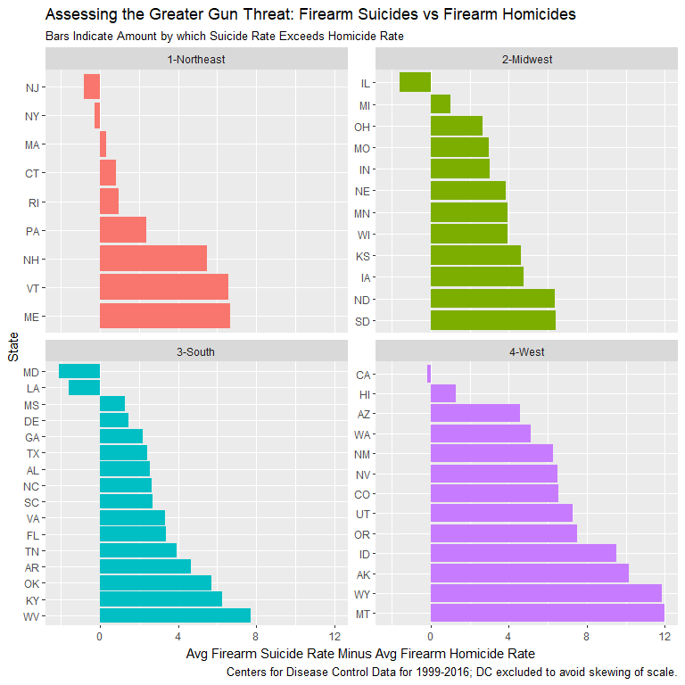
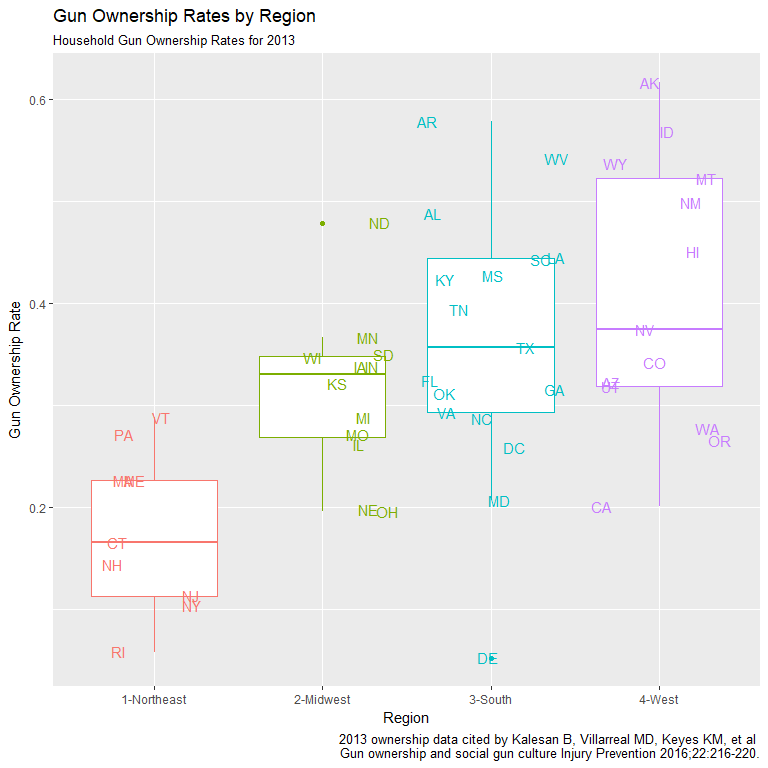
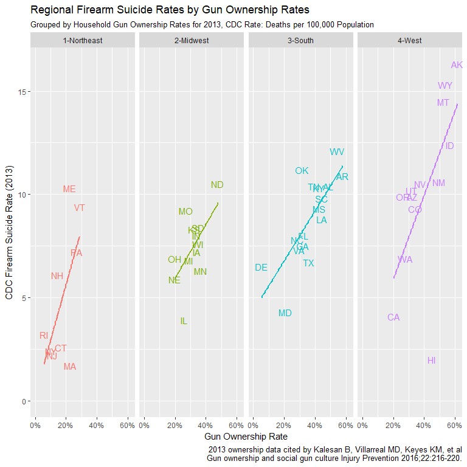
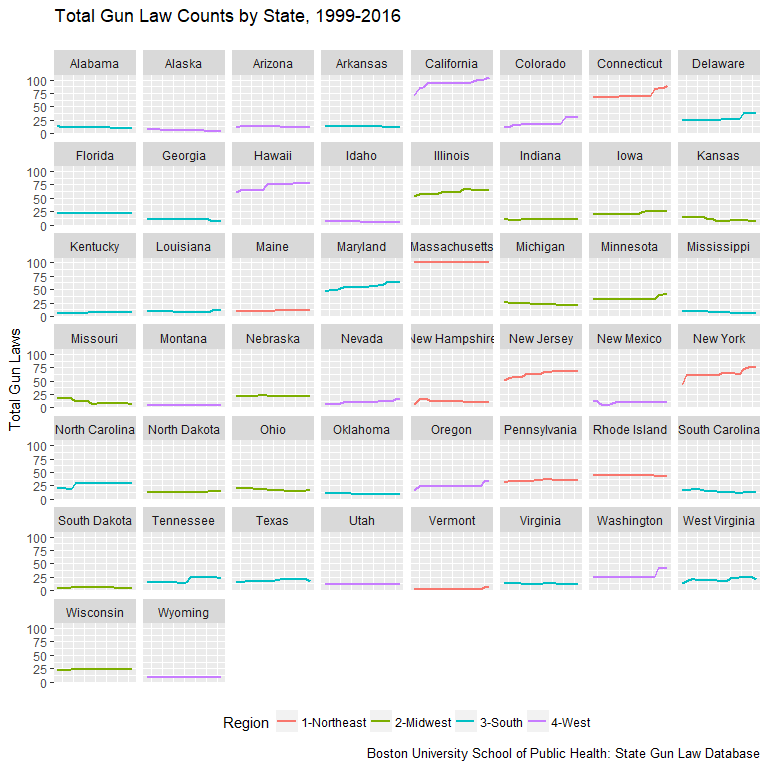

Milestone Report
================
Jim Scotland
Revised: April 17, 2018

Abstract
--------

This project will explore the often overlooked issue of firearm suicide in the United States. The analysis will include an overall picture of the degree and distribution of firearm suicides and an investigation of the key state-level variables of gun ownership rates and gun control legislation. Linear regression models will be developed to test the relationship between ownership levels, gun law categories and state firearm suicide rates. Finally, specific classes of gun laws will be evaulated to determine their potential effect in reducing firearm suicide deaths.

The Data
--------

The [Centers for Disease Control and Prevention](https://wonder.cdc.gov/) provides the state-level firearm homicide and suicides rates as well as overall suicide rates annually for the period of 1999 to 2016. Limited state gun law data comes from the [Giffords Law Center](http://lawcenter.giffords.org/) for 2014 to 2016. Annual gun law data for 1999 to 2016 was accessed at the Boston University School of Public Health [State Firearm Law database](https://www.statefirearmlaws.org/index.html). State level gun ownership data is exceedingly rare. This analysis was developed utilizing 2013 gun ownership survey results published in the journal [Injury Prevention](http://injuryprevention.bmj.com/content/22/3/216) for a paper by Bindu Kalesan et al., titled *Gun Ownership and Social Gun Culture*.

Data Issues
-----------

### Gun Ownership Rates

Gun ownership data presents conflicting issues. The survey data acquired from the Kalesan Injury Prevention article covers only the single year of 2013. This limits the ability to analyze shifts in state level gun ownership rates over time. Dr. Michael Siegel at the Boston University School of Public Health has developed a [proxy ownership metric](https://www.ncbi.nlm.nih.gov/pubmed/23956369) that has been calculated from 1980 to 2016. This data was acquired directly from Dr. Siegel and was integrated into the analysis. However, the proxy measurement utilizes the firearm suicide rate (FSR) in its calculation. As the FSR is the dependent variable of interest in this study, this proxy measure was not utilized the final analysis. Sharp discrepancies between Siegel's proxy measure and the Kalesan 2013 survey results strongly supports the need for better data on this critical variable.

### State Firearm Laws

The State Firearm Law database tracks 132 separate law variables over a twenty-plus year period. For purposes of simplification, the 132 laws were grouped into the 14 larger categories outlined in the code file. Yet, the most frequent count for many of these categories remains zero as shown in this [linked map plot](https://raw.githubusercontent.com/datahoundz/Springboard_Data_Science/master/law_cat_map.png) (zero values in light blue). In these cases the measure is more binary than one of degree - does the state have *any* laws within a given category? This makes comaprisons between states more challenging, especially when combined with gun ownership data for only a single year.

Preliminary Findings
--------------------

### Firearm Suicide Nearly Twice as Frequent as Firearm Homicide

The average state firearm suicide rate (FSR) is nearly twice as high as the the average firearm homicide rate (FHR). In more rural states, the disparity is even greater. Only six states have firearm homicide rates that exceed their firearm suicide rates. Five of these six states have an FSR far below the national average.

### Overall Suicide Rates Higher in Rural States and the Mountain Subregion

Overall suicide rates display a strong negative correlation (-0.759) with a state's population density and also exhibit significant regional influences. States in the Northeast have much lower rates, while states in the Mountain subregion experience sharply higher levels than the rest of the country. This holds even allowing for population density as shown by Mountain vs Great Plains divergence at similar population densities.

### Method of Suicide and Trendlines Vary Widely by Subregion and State

Time series plot of suicides broken out by firearm/other indicates major regional differences. Coastal states exhibit much lower firearm rates and at levels that appear more steady compared to other methods and other states. State level plots show these disparities existing within subregions as well.

### Gun Ownership Rates Vary by Region

The Northeast has the lowest gun ownership rates, while the South and West display much higher levels.

### Gun Ownership Correlates with OVERALL Suicide Rates

A positive correlation of 0.644 and an r2 of 0.415 exists between a state's overall suicide rate and it's level of household gun ownership. Regional effects are particularly pronounced in the Northeast and West.

    ## # A tibble: 1 x 3
    ##       N   cor    r2
    ##   <int> <dbl> <dbl>
    ## 1    50 0.644 0.415

### Stronger Correlation Between Gun Ownership and Firearm Suicide

Gun ownership rates, unsurprisingly, display an even stronger relationship to the state's firearm suicide rate with a correlation of 0.748 and an r2 of 0.559. The map plot highlights regional variations in this effect as further displayed by the regional correlation plot.

    ## # A tibble: 1 x 3
    ##       N   cor    r2
    ##   <int> <dbl> <dbl>
    ## 1    50 0.748 0.559

### Firearm Suicides Associated with Higher Overall Suicide Rates

Since 1999, guns accounted for an average 58% of suicides in states with above average suicide rates and 48% of suicides in states with below average rates (average rates calculated annually).

    ## # A tibble: 2 x 4
    ##   abv_avg_rate     n deaths avg_gun_pct
    ##   <lgl>        <int>  <int>       <dbl>
    ## 1 FALSE          502 437229       0.486
    ## 2 TRUE           398 210903       0.583

### Giffords Law Grades Strong Indicator of Gun Deaths

A state's Giffords Law Grade not only works as a strong predictor of both overall gun death rank and firearm suicide rates, it even helps to predict a state's overall suicide rate. This provides additional support to the possibilty that easier availability of guns may contribute to higher overall suicide rates.

### Giffords "F" Grade Associated with Above Average OVERALL Suicide Rate

Out of 50 states, 41 Abv Avg Suicide ratings were indicated correctly by Gifford F. Displayed data for 2016. Slightly lower accuracy in 2014 and 2015 at 38/50 each.

    ##           Abv_Average_Rate
    ## Giffords_F FALSE TRUE
    ##      FALSE    21    4
    ##      TRUE      5   20

### Total Gun Laws Vary Widely by Region and Within Regions

As the state level plots below indicate, both the number of gun laws and the trend, increasing or decreasing varies significantly across the country. Even within the highly regulated Northeast, the more rural states of Vermont Maine and New Hampshire have gun laws at levels simialr to the South or Mountain west. Only twelve states, concentrated on the East and West coasts, have significantly increased the number of gun laws between 1999 and 2016. This compares to 18 states that decreased the number of laws during the same period.

### Strong Inverse Relation Between Total Gun Laws and Firearm Suicide Rates

A strong inverse relationship exists between the number of state gun laws and the firearm suicide rate and this relationship is even more pronounced at regional levels.

    ## # A tibble: 1 x 2
    ##       N    r2
    ##   <int> <dbl>
    ## 1    50 0.617

    ## # A tibble: 4 x 3
    ##   region          N    r2
    ##   <chr>       <int> <dbl>
    ## 1 1-Northeast     9 0.814
    ## 2 2-Midwest      12 0.841
    ## 3 3-South        16 0.484
    ## 4 4-West         13 0.736

### Reduced Gun Laws Related to Increased Firearm Suicide Rate

States that reduced their total number of gun laws saw their average FSR increase by 5X the level experienced by states that implemented 10 or more new gun laws (Large Increase).

### Select State Comparisons

By way of comparison, Missouri eliminated a net of 10 gun laws and saw its FSR rise by 3.0 per 100,000. California implemented 33 new gun laws and saw its FSR drop by 0.5 per 100,000. Adjusting for population, Missouri saw an estimated 176 more suicides in 2016 while California saved an estimated 183 lives. The equivalent numbers for New York and South Carolina are 39 lives saved and 151 additional suicides repsectively.

Preliminary Conclusions
-----------------------

Analysis to this point suggests some strong candidate variables for predicting a state's firearm suicide rate, several of which correlate with each other. These include region, gun ownership rates, the level of gun law restrictions and population density.

During the machine learning phase of the project, an effort will be made to focus more closely on regional distinctions. The analysis will also shift from the simple total number of laws to explore specific law categories and perhaps even individual laws.

The goal of this analysis is to explore firearm suicide; however, preliminary findings suggest that many of the candidate variables are reasonably strong predictors of overall suicide levels as well. This is to be expected as the FSR represents around half of the overall suicide rate. But it would be interesting to explore how specific classes of gun legislation or other actions might effectively reduce the overall rate, especially in states with disproprtionately high FSR levels.

Another area of interest raised is the disparity between suicide rates in the Mountain and Great Plains subregions, both of which are characterized by similarly low population densities. Additionally sharp differences between neighboring states, Indiana and Illinois for example, present opportunities for more focused investigation of states with similar population profiles.
