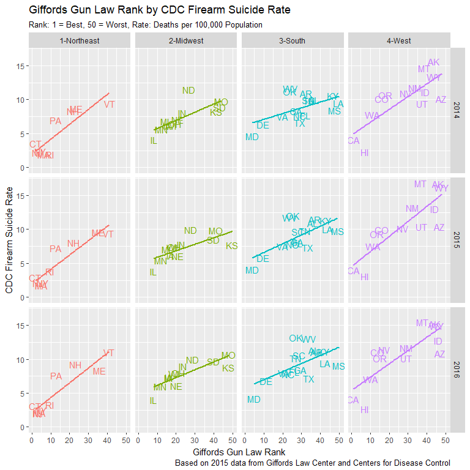
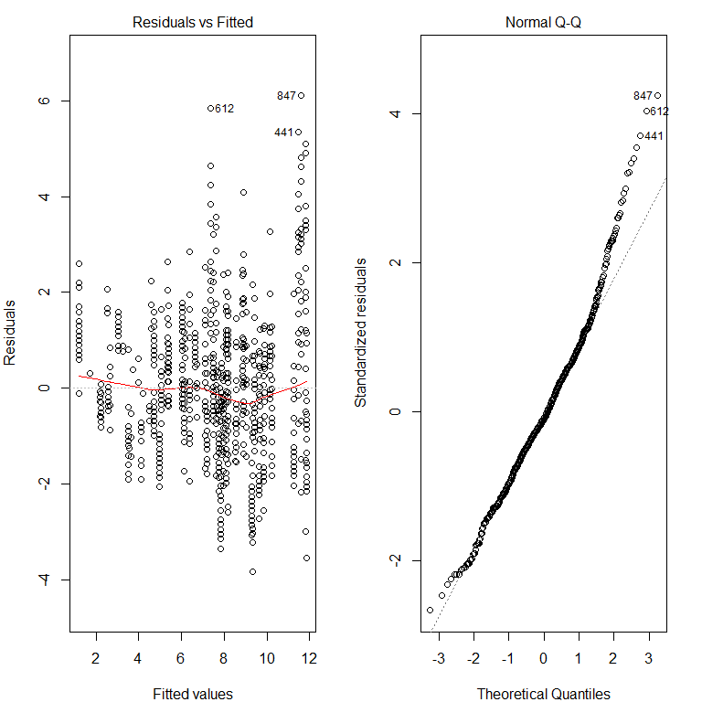

Firearm Suicide: The Hidden Side of Gun Violence
================================================

The Problem
-----------

**The individual most likely to kill a gun owner is …himself.** In the ongoing discussions of mass shootings and gun regulation, few address this less newsworthy fact. The CDC reports that 37,353 people were killed by firearms in 2016. Suicides, at 22,938, made up over 60% of those deaths. In 42 states an individual is more likely to kill themselves with a gun than to be shot dead by an assailant. The greatest risk to a gun owner is his own gun.

Best States for Gun Owners?
---------------------------

The 2015 Guns & Ammo rankings for ["Best States for Gun Owners"](http://www.gunsandammo.com/network-topics/culture-politics-network/best-states-for-gun-owners-2015/) bear an uncanny relationship to another data set, state level firearm suicide rates. Alaska, Wyoming and Montana rank 3rd, 6th and 11th respectively in the Guns & Ammo rankings. They also boast, by far, the highest firearm suicide rates (FSR) in the country. Guns & Ammo ranks Massachusetts, New Jersey and New York at 48, 49 and 50. These three states post the lowest FSR levels in the nation. In 2015, the FSR for Massachusetts was approximately ten times lower than the rate for Montana. This equated to 118 gun suicides in Massachusetts compared to 174 in Montana, with a population nearly seven times smaller. In addition, Massachusetts, a highly urbanized northeastern state, also registered a lower firearm *homicide* rate. By these measures, it is hard to determine what is meant by "The Best States for Gun Owners".


Abstract
--------

This project will explore the often overlooked issue of firearm suicide in the United States. The analysis will include an overall picture of the degree and distribution of firearm suicides and an investigation of the key state-level variables of gun ownership rates and gun control legislation. Linear regression models will be developed to test the relationship between ownership levels, gun law categories and state firearm suicide rates. Finally, specific classes of gun laws will be evaluated to determine their potential effect in reducing firearm suicide deaths.

The Data
--------

The [Centers for Disease Control and Prevention](https://wonder.cdc.gov/) provides the state-level firearm homicide and suicides rates as well as overall suicide rates annually for the period of 1999 to 2016. Gun law grades and limited state gun law and gun death data comes from the [Giffords Law Center](http://lawcenter.giffords.org/) for 2014 to 2016. Highly detailed annual gun law data for 1999 to 2016 was accessed at the Boston University School of Public Health [State Firearm Law database](https://www.statefirearmlaws.org/index.html). State level gun ownership data is exceedingly rare. This analysis was developed utilizing 2013 gun ownership survey results published in the journal [Injury Prevention](http://injuryprevention.bmj.com/content/22/3/216) for a paper by Bindu Kalesan et al., titled *Gun Ownership and Social Gun Culture*.

Data Preparation
----------------

### Data Import and Clean-Up of Variable Names and Types

During data import, all variable names were converted to lower case and spaces were replaced with underscores. Variable names were shortened where possible and shared variable names were standardized to facilitate the table joins. Other names had to be made more distinct to accommodate planned table merges. In addition, certain variables had to be converted from character to integer or numerical types. All imported files were converted to data frames with names that clearly indicated the nature of the data.

### Missing State Level CDC Suicide and Homicide Data

Several states were missing CDC homicide and suicide data for specific years. To assure the same 18 years of data for every state, both the suicide and homicide tables were joined to a complete CDC population data table. A consequent review of the state level data indicated that missing entries were likely not zero values. Further review of state level min, max and mean values suggested replacing the missing values with a state mean. After replacing the missing death count values, the related death rate NA’s were calculated where missing. Data was inspected for consistency and outliers, revealing only that the District of Columbia has an unusually high homicide rate, partially the result of a very small population base.

### Letter to Score and Reordered Rankings of Giffords Gun Law Grades

The Giffords gun law data included letter grades, but the analysis would be better served by also having numerical grades. The was addressed by joining the gun law data to a letter grade conversion table and then using a mutate command to populate an equivalent numerical gun law score in the gun law data table. A second issue arose from the gun death ranking variable running from low to high, with highest being the best ranking. This was the opposite of the gun law rankings where low scores were the best. It was decided to maintain the same low-high ranking logic across variables and convert the death rank scores accordingly.

### Collapsing Variables for Boston University State Gun Law Data

The state gun law data tracked back to 1991 and included 134 gun law variables. First, the data was filtered to include only the 1999-2016 time frame covered by the CDC data. Second, and much more complicated, a law category data table was created with specific laws grouped into broader categories reducing the number of gun law variables from 134 to 14. The additional source state law code file facilitated this process, providing the category names and the related variables for the required mutate sequence. The original disaggregated file was retained for potential use at the machine learning phase of the capstone project.

### State Region and Subregion Census Data

Census Bureau data for state regions and sub-regions were imported to allow higher level data analysis investigating regional differences in gun ownership, gun laws and gun deaths. A unite command created region and subregion variables combining the code number and the name for simpler sorting of data legends when creating plots.

The source R-code file is available in a GitHub repository [here](https://github.com/datahoundz/Springboard_Data_Science/blob/master/01_data_import.R) and cleaned csv files are [here](https://github.com/datahoundz/Springboard_Data_Science/tree/master/data_cleaned).

Data Issues
-----------

### Excluding the District of Columbia

The District of Columbia was excluded from the analysis. As the lone geographical unit that is both a city and a state, its homicide rates were extremely high skewing any plots that included it. Inversely, DC's suicide rate is the lowest in the country with several years posting no suicide data at all. Also, several other data sources include only state level data without figures for DC. It is believed that these reasons justify its exclusion from this analysis.

### Gun Ownership Rates

Gun ownership data presents conflicting issues. The survey data acquired from the Kalesan Injury Prevention article covers only the single year of 2013. This impairs the ability to analyze shifts in state level gun ownership rates over time. Dr. Michael Siegel at the Boston University School of Public Health has developed a [proxy ownership metric](https://www.ncbi.nlm.nih.gov/pubmed/23956369) that has been calculated from 1980 to 2016. This data was acquired directly from Dr. Siegel and was integrated into the analysis. However, the proxy measurement utilizes the firearm suicide rate as a key element in its calculation. As the FSR is the dependent variable of interest in this study, this proxy measure was not utilized in the final analysis. Sharp discrepancies between Siegel's proxy measure and the Kalesan 2013 survey results, as illustrated in the plot below, strongly supports the need for better data on this critical variable.


### State Firearm Laws

The State Firearm Law database tracks 132 separate law variables over more than twenty years. For purposes of simplification, the 132 laws were grouped into the 14 larger categories outlined in the code file. Yet, the most frequent count for many of these categories remains zero as shown in this [linked map plot](https://raw.githubusercontent.com/datahoundz/Springboard_Data_Science/master/law_cat_map.png) (zero values in pale green). In these cases the measure is more binary than one of degree - does the state have *any* laws within a given category? This makes comparisons between states more challenging, especially when combined with gun ownership data for only a single year.

Firearm Suicide Takes More Lives, and It's Getting Worse
--------------------------------------------------------

Firearm suicides not only consistently exceed firearm homicides, the divergence has been growing. Since 2008, the number of American's taking their lives with a gun has risen steadily with no indication of slowing down. Firearm homicides, by contrast, remained fairly steady and even posted several years of declines until the last few years.


### Firearm Suicide Nearly Twice as Frequent as Firearm Homicide

The average state firearm suicide rate (FSR) is nearly twice as high as the the average firearm homicide rate (FHR). In more rural states, the disparity is even greater. Only six states have firearm homicide rates that exceed their firearm suicide rates. Five of these six states have an FSR far below the national average.


### Rural and Mountain States Suffer Higher Overall Suicide Rates

Overall suicide rates display a strong negative correlation (-0.759) with a state's population density and also exhibit significant regional influences. States in the Northeast have much lower rates, while states in the Mountain subregion experience sharply higher levels than the rest of the country. This holds even allowing for population density as shown by the discrepancy between Mountain and Great Plains states at similar population densities.


### Suicide Methods and Trends Differ Widely by Subregion and State

Time series plots of suicides broken out by firearm/other indicate major regional differences. Coastal states exhibit much lower firearm rates and at levels that appear more steady compared to other suicide methods and other states. State level plots show these disparities existing within subregions as well.


More Gun Ownership, More Suicides
---------------------------------

### Gun Ownership Rates Vary by Region

The Northeast has the lowest gun ownership rates, while the South and West display much higher levels.


### Gun Ownership Correlates with OVERALL Suicide Rates

A positive correlation of 0.644 and an r2 of 0.415 exists between a state's overall suicide rate and it's level of household gun ownership. Regional effects are particularly pronounced in the Northeast and West.


### Mountain States Plagued by High Suicide Rates

Arizona is the only Mountain state to escape the "High" overall suicide classification. Higher population states appear to experience lower suicide levels generally.


### Higher Suicide Levels in Rural States Across Regions

Regional plots bear out the relationship between population density and overall suicide with rural states commanding the upper end of regional FSR levels.


More Gun Ownership, More Gun Suicides
-------------------------------------

### Strong Correlation Between Gun Ownership and Firearm Suicide

Gun ownership rates, unsurprisingly, display an even stronger relationship to the state's firearm suicide rate with a correlation of 0.748 and an r2 of 0.559. The map plot highlights regional variations in this effect as further displayed by the regional correlation plot.


### Clear Picture of FSR Issue in Mountain States

Utah is the only Mountain state to dodge the "High" FSR classification. Coastal states tend toward lower FSR levels, Alaska being an obvious exception.


### Regional Plots Highlight Rural/Urban Divide

Rural states rank higher for FSR across all four major regions, while highly urbanized states dominate the lower range of the plots.


### Gun Ownership Tiers Call Out Impact on FSR

High ownership states account for 12 of the 13 states with the highest FSR levels. Low ownership states included 11 of the 13 lowest FSR states. Hawaii is almost certainly misrepresented as a high ownership state. Dr. Michael Siegel's proxy data suggests an average ownership rate of only 12.2% as compared to 45.1% from the Kalesan 2013 survey data.


### Firearms Contribute to Above Average *Overall* Suicide Rates

Since 1999, guns accounted for an average 58% of suicides in states with above average suicide rates and 48% of suicides in states with below average rates (average rates calculated annually).

    ## # A tibble: 2 x 4
    ##   abv_avg_rate     n deaths avg_gun_pct
    ##   <lgl>        <int>  <int>       <dbl>
    ## 1 FALSE          502 437229       0.486
    ## 2 TRUE           398 210903       0.583

Giffords Gun Law Grades Simplify the Picture
--------------------------------------------

### Giffords Law Grades Strong Indicator of Gun Deaths

A state's Giffords Law Grade not only works as a strong predictor of both overall gun death rank and firearm suicide rates, it even helps to predict a state's overall suicide rate. This provides additional support to the hypothesis that easier availability of guns contributes to higher overall suicide rates.


### Giffords Rank Solid Predictor of FSR Levels

The regional plot reveals the strong relationship between the gun law rank and the FSR. The relationship holds steadily over the three-year period for which data was available. It also indicates the stability of each state's position in these rankings.



### Giffords "F" Associated with Above Average *Overall* Suicide Rate

Out of 50 states, 41 Abv Avg Suicide ratings were indicated correctly by Gifford F. Displayed data for 2016. Slightly lower accuracy in 2014 and 2015 at 38/50 each.


    ##           Abv_Average_Rate
    ## Giffords_F FALSE TRUE
    ##      FALSE    21    4
    ##      TRUE      5   20

### Giffords Grade Map Displays Prevalence of "F" Ratings

The map of Giffords Grades presents an almost shocking image of the prevalence of "F" grades across the United States. The South appears distinctly lacking in non-F states. The northern Mountain and Prairie states represent another pocket of light regulation. Grades of A and B are concentrated in the Northeast and West coast. 

### Overall Suicide Map Discloses Flipped Regional Images

The New England/Mid-Atlantic region and the Northern Mountain/Plains exhibit a flipped mirror image of the Giffords Grade map. On the other hand, the South and Pacific Northwest evade the direct relationship. 

Strong Firearm Legislation, Lower Firearm Suicides
--------------------------------------------------

### Gun Regulation Varies Widely by Region and Within Regions

As the state level plots below indicate, both the number of gun laws and the trend, increasing or decreasing varies significantly across the country. Even within the highly regulated Northeast, the more rural states of Vermont Maine and New Hampshire have gun laws at levels similar to the South or Mountain West.


### Increased Gun Regulation Occuring Mostly on Coasts

Only twelve states, concentrated on the East and West coasts, have significantly increased the number of gun laws between 1999 and 2016. This compares to 18 states that decreased the number of laws during the same period.


### Strong Inverse Relation Between Regulation and Firearm Suicides

A strong inverse relationship exists between the number of state gun laws and the firearm suicide rate and this relationship is even more pronounced at regional levels.


### Regional Plot of Regulation Mirrors Ownership Rates

The distribution of regulation reflects the inverse of the pattern seen with ownership rates. Here gun legislation levels are higher in more urbanized states and lower in the rural areas.


### Reduced Gun Laws, Increased FSR Deaths

States that reduced their total number of gun laws saw their average FSR increase by 5X the level experienced by states that implemented 10 or more new gun laws (Large Increase).


### Select State Comparisons

By way of comparison, Missouri eliminated a net of 10 gun laws and saw its FSR rise by 3.0 per 100,000. California implemented 33 new gun laws and saw its FSR drop by 0.5 per 100,000. Adjusting for population, Missouri saw an estimated 176 more suicides in 2016 while California saved an estimated 183 lives. The equivalent numbers for New York and South Carolina are 39 lives saved and 151 additional deaths respectively.


Preliminary Conclusions
-----------------------

Analysis to this point suggests some strong candidate variables for predicting a state's firearm suicide rate, several of which correlate with each other. These include region, gun ownership rates, the level of gun law restrictions and population density.

During the machine learning phase of the project, an effort will be made to focus more closely on regional distinctions. The analysis will also shift from the simple total number of laws to explore specific law categories and even individual laws.

Machine Learning Plan
---------------------

### The Machine Learning Problem

This research seeks to identify factors that might addressed to reduce firearm suicide rates. Consequently, the machine learning problem is to discover the variables that most effectively predict a state’s firearm suicide rate (FSR). This question lends itself very naturally to a supervised multivariate regression approach.

### Critical Features of the Model

The state level firearm suicide rate is the targeted dependent value. Initial statistical analysis suggests candidates for significant independent variables. These include the state level firearm ownership rates, the number of state level gun control laws – both overall total and counts for specific law categories, census geographic regions and state population density. Additionally, a single national level overall suicide rate for each year will be considered to account for the steady rise in suicide rates, particularly since 2008.

### Gun Ownership Rate Concerns

State level ownership rates are elusive, and the model will depend on rates for 2013 only. This means the model will not account for shifts in ownership rates over the 18-year analysis period. The reliability of the state level gun ownership data presents a second concern. Additional research uncovered another set of 30-year average proxy ownership rates that varies significantly from the modeled data. The annual proxy ownership rates underlying these averages were kindly provided by Dr. Michael Siegel at the Boston University School of Public Health. Unfortunately, this proxy is largely derived from firearm and overall suicide figures. The first is the dependent variable of interest, and the second is made up in part by the first and thus overlapping and highly correlated.

### Time Sensitivity Issues

An additional concern is the reliance on geographic region as an independent variable. This variable is also constant over time, meaning that two of the three primary predictive variables are time invariant. This is a significant drawback of the proposed model as the number of gun laws is the only critical independent variable that varies over time. This fact contributed to the consideration of the national overall suicide rate to account for changes over time. However, this approach again ran into the same issues posed by the ownership proxy.

### Manual Modelling Technique and Evaluation

The predictions will be based upon a multivariate regression model using 2013 data (ownership survey year) to train the model and the remaining data to test it. Variable selection will be based upon the strength of the multiple r-squared value on the training set with an eye to variables with higher absolute values for coefficients and t-values and high significance levels. Residual plots and Q-Q plots will be created to check for data skewing and outlier values. Evaluation will include calculating the r-squared for the predicted and targeted values along with the RMSE figures for the same. In addition to residual and Q-Q plots, gain plots will be created to further visually display model performance.

### Random Forest Models

One random forest model will be created utilizing only the 14 law categories and another using the 132 specific law variables. Their creation is primarily to determine the degree to which law variables alone can predict a state’s FSR.

### Gradient Boost Models

Like the random forest approach above, the primary reason for gradient boost modelling is to assess the ability of law variables alone to predict FSR. However, the gradient boost approach allows the chance to view variables in terms of their importance to the model. After assessing variable importance, an effort will be made to manually create a more effective regression model. Model evaluation will be assessed as above except that the train/test data will be a randomized 70/30 split of the dataset.

The machine learning R data file is available [here](https://github.com/datahoundz/Springboard_Data_Science/blob/master/04_mach_learn.R).

Machine Learning Process
------------------------

A data frame, mach\_data\_df, including *all* primary variables of interest has been created. Region and subregion variables of interest were converted to individual factor variables.

    ## Classes 'tbl_df', 'tbl' and 'data.frame':    900 obs. of  34 variables:
    ##  $ year       : int  1999 2000 2001 2002 2003 2004 2005 2006 2007 2008 ...
    ##  $ state      : chr  "Alabama" "Alabama" "Alabama" "Alabama" ...
    ##  $ usps_st    : chr  "AL" "AL" "AL" "AL" ...
    ##  $ region     : chr  "3-South" "3-South" "3-South" "3-South" ...
    ##  $ subregion  : chr  "6-South Central East" "6-South Central East" "6-South Central East" "6-South Central East" ...
    ##  $ reg_code   : Factor w/ 4 levels "1","2","3","4": 3 3 3 3 3 3 3 3 3 3 ...
    ##  $ subreg_code: Factor w/ 9 levels "1","2","3","4",..: 6 6 6 6 6 6 6 6 6 6 ...
    ##  $ gun_rate   : num  9.8 9.6 8.7 8.5 8.9 8.3 8.1 8.6 8.5 9 ...
    ##  $ other_rate : num  2.7 3.5 2.8 3 2.6 3.7 3.6 3.9 4.2 3.8 ...
    ##  $ all_rate   : num  12.5 13.1 11.5 11.5 11.5 12 11.7 12.5 12.7 12.8 ...
    ##  $ pop_density: num  87.5 87.9 88.2 88.5 88.9 ...
    ##  $ lawtotal   : int  16 11 11 11 11 11 11 11 11 11 ...
    ##  $ deal_reg   : int  6 5 5 5 5 5 5 5 5 5 ...
    ##  $ buy_reg    : int  1 0 0 0 0 0 0 0 0 0 ...
    ##  $ high_risk  : int  1 1 1 1 1 1 1 1 1 1 ...
    ##  $ bkgrnd_chk : int  0 0 0 0 0 0 0 0 0 0 ...
    ##  $ ammo_reg   : int  0 0 0 0 0 0 0 0 0 0 ...
    ##  $ poss_reg   : int  0 0 0 0 0 0 0 0 0 0 ...
    ##  $ conceal_reg: int  3 3 3 3 3 3 3 4 4 4 ...
    ##  $ assault_mag: int  0 0 0 0 0 0 0 0 0 0 ...
    ##  $ child_acc  : int  0 0 0 0 0 0 0 0 0 0 ...
    ##  $ gun_traff  : int  0 0 0 0 0 0 0 0 0 0 ...
    ##  $ stnd_grnd  : int  1 1 1 1 1 1 1 0 0 0 ...
    ##  $ pre_empt   : int  1 0 0 0 0 0 0 0 0 0 ...
    ##  $ immunity_  : int  1 0 0 0 0 0 0 0 0 0 ...
    ##  $ dom_viol   : int  0 0 0 0 0 0 0 0 0 0 ...
    ##  $ own_rate   : num  0.489 0.489 0.489 0.489 0.489 0.489 0.489 0.489 0.489 0.489 ...
    ##  $ siegel_rate: num  0.497 0.497 0.497 0.497 0.497 0.497 0.497 0.497 0.497 0.497 ...
    ##  $ own_proxy  : num  0.51 0.477 0.493 0.483 0.496 ...
    ##  $ reg_west   : logi  FALSE FALSE FALSE FALSE FALSE FALSE ...
    ##  $ reg_neast  : logi  FALSE FALSE FALSE FALSE FALSE FALSE ...
    ##  $ reg_midw   : logi  FALSE FALSE FALSE FALSE FALSE FALSE ...
    ##  $ reg_south  : logi  TRUE TRUE TRUE TRUE TRUE TRUE ...
    ##  $ reg_mtn    : logi  FALSE FALSE FALSE FALSE FALSE FALSE ...

### Train & Test Split

Two methods were considered for dividing the train and test data. It was decided to utilize the 2013 data as the training set since it contained the actual 2013 ownership rate survey results. The alternative 70/30 spit code is left, but commented out, in the event that the 2013 training data decision is reversed.

``` r
# Split into train & test data sets at 70/30 ratio
# set.seed(123) 
# sample <- sample.int(n = nrow(mach_data_df), size = floor(0.70 * nrow(mach_data_df)), replace = F)
# train_df <- mach_data_df[sample, ]
# test_df  <- mach_data_df[-sample, ]

# # Use 2013 as train and balance as test
train_df <- mach_data_df %>% filter(year == 2013)
test_df <- mach_data_df %>% filter(year != 2013)
```

### Review Correlation Table for Colinearity Issues

Run correlation matrix on prospective variables.
*train\_df\[ , 8:ncol(train\_df)\] %&gt;% cor()*

The extensive correlation matrix (too large too display) revealed several areas of high colinearity which were taken into account in the variable selection for the model. Then a simplified table of correlations with the target variable of gun\_rate (FSR) was created to determine candidate variables for model selection.

    ##           Var1     Var2    Freq
    ## 1     gun_rate gun_rate  1.0000
    ## 2     all_rate gun_rate  0.9057
    ## 3  siegel_rate gun_rate  0.8953
    ## 4    own_proxy gun_rate  0.8799
    ## 5     lawtotal gun_rate -0.7864
    ## 6      buy_reg gun_rate -0.7616
    ## 7     own_rate gun_rate  0.7479
    ## 8    child_acc gun_rate -0.7163
    ## 9  pop_density gun_rate -0.7006
    ## 10    deal_reg gun_rate -0.6778
    ## 11    pre_empt gun_rate -0.6733
    ## 12  bkgrnd_chk gun_rate -0.6577
    ## 13    ammo_reg gun_rate -0.6242
    ## 14    dom_viol gun_rate -0.6095
    ## 15   high_risk gun_rate -0.5927
    ## 16 assault_mag gun_rate -0.5648
    ## 17    poss_reg gun_rate -0.5587
    ## 18 conceal_reg gun_rate -0.5257
    ## 19   immunity_ gun_rate -0.5114
    ## 20   gun_traff gun_rate -0.4869
    ## 21     reg_mtn gun_rate  0.4562
    ## 22   reg_neast gun_rate -0.4461
    ## 23   stnd_grnd gun_rate -0.3795
    ## 24    reg_west gun_rate  0.3601
    ## 25   reg_south gun_rate  0.1428
    ## 26    reg_midw gun_rate -0.1245
    ## 27  other_rate gun_rate  0.0343

### Variable Selection Process

A review of the above table showed the high correlation levels for overall suicide (all\_rate) as well as the siegel\_rate and own\_proxy each of which include the target variable within their derivation. While total laws (lawtotal) had a higher correlation than buyer regulations (buy\_reg), the latter was selected as a more narrow and conservative option. Ownership rate (own\_rate) was a clear variable choice from the outset as was population density (pop\_density).

Among other law category variables, child access laws (child\_acc), dealer regulations (deal\_reg), preemption laws (pre\_empt), background checks (bkgrnd\_chk), domestic violence (dom\_viol) and high-risk (high\_risk) were all selected for consideration in the regression model. High colinearity between several of the law category variables posed issues in model development and was taken into account. All region variables were considered as well, both alone and in combination with other variables.

### Selected Variables

**The most effective variables in combination were ownership rate, buyer regulations and region West.** Several promising variables like population density and the regional variables for Mountain and Northeast performed well individually but failed to increase model performance significantly in combination with other independent variables.

### Model Performance on Training Data

**The model accounted for 82.5% of the variation in the firearm suicide rate on the training data for 2013.** Ownership rates have the largest effect but are also subject to a higher standard error. Buyer regulations contribute significantly to model accuracy with values of this variable ranging only from 0 to 15. The addition of region West added 3.0 percentage points to prediction accuracy. This modest increase exceeded that of any other region or combination of regions while also maintaining an acceptable significance level.

    ## 
    ## Call:
    ## lm(formula = gun_rate ~ own_rate + buy_reg + reg_west, data = train_df)
    ## 
    ## Residuals:
    ##    Min     1Q Median     3Q    Max 
    ## -2.937 -0.879 -0.342  0.866  3.333 
    ## 
    ## Coefficients:
    ##              Estimate Std. Error t value      Pr(>|t|)    
    ## (Intercept)    5.4303     0.6744    8.05 0.00000000025 ***
    ## own_rate      10.7614     1.8018    5.97 0.00000031824 ***
    ## buy_reg       -0.5288     0.0647   -8.17 0.00000000016 ***
    ## reg_westTRUE   1.4259     0.4959    2.88        0.0061 ** 
    ## ---
    ## Signif. codes:  0 '***' 0.001 '**' 0.01 '*' 0.05 '.' 0.1 ' ' 1
    ## 
    ## Residual standard error: 1.43 on 46 degrees of freedom
    ## Multiple R-squared:  0.825,  Adjusted R-squared:  0.814 
    ## F-statistic: 72.5 on 3 and 46 DF,  p-value: <0.0000000000000002

    ##               2.5 % 97.5 %
    ## (Intercept)   4.073  6.788
    ## own_rate      7.135 14.388
    ## buy_reg      -0.659 -0.399
    ## reg_westTRUE  0.428  2.424

### Plug Prediction Back Into Training Data and Check r2 and RMSE

Testing predictions against observed values confirms the 0.825 r-squared value, with an RMSE of 1.38.

    ## [1] 0.825

    ## [1] 1.38

### Check Model Residuals vs Fitted and Q-Q Plots

The residual and Q-Q plots indicate reasonable distribution of model error, although the data starts to skew above expected levels at higher values.


### Check Identified Outliers

    ## # A tibble: 3 x 7
    ##    year state      predict gun_rate own_rate buy_reg reg_west
    ##   <int> <chr>        <dbl>    <dbl>    <dbl>   <int> <lgl>   
    ## 1  2013 Alaska       13.0     16.3     0.617       1 TRUE    
    ## 2  2013 Oklahoma      8.26    11.2     0.312       1 FALSE   
    ## 3  2013 Washington    9.84     6.90    0.277       0 TRUE

Apply Regression Model to Test Data
-----------------------------------

### Model Performance on Test Data

Model performance declined from the initial training data, but this was largely expected given the significant size discrepancy between the training set and the test set. **The model accounted for 77.3% of the variation in the test data set.** The coefficient estimate for the ownership rate dropped but so did the standard error and the t-value, a likely result of the larger data set. The impact of region West increased as did its level of significance. The confidence interval table reflects a much tighter range of values.

    ## 
    ## Call:
    ## lm(formula = mod2, data = test_df)
    ## 
    ## Residuals:
    ##    Min     1Q Median     3Q    Max 
    ## -3.834 -0.923 -0.137  0.846  6.115 
    ## 
    ## Coefficients:
    ##              Estimate Std. Error t value            Pr(>|t|)    
    ## (Intercept)    5.0766     0.1644    30.9 <0.0000000000000002 ***
    ## own_rate       8.8886     0.4382    20.3 <0.0000000000000002 ***
    ## buy_reg       -0.4872     0.0163   -29.8 <0.0000000000000002 ***
    ## reg_westTRUE   1.7261     0.1211    14.2 <0.0000000000000002 ***
    ## ---
    ## Signif. codes:  0 '***' 0.001 '**' 0.01 '*' 0.05 '.' 0.1 ' ' 1
    ## 
    ## Residual standard error: 1.44 on 846 degrees of freedom
    ## Multiple R-squared:  0.773,  Adjusted R-squared:  0.772 
    ## F-statistic:  961 on 3 and 846 DF,  p-value: <0.0000000000000002

    ##               2.5 % 97.5 %
    ## (Intercept)   4.754  5.399
    ## own_rate      8.028  9.749
    ## buy_reg      -0.519 -0.455
    ## reg_westTRUE  1.488  1.964

### Plug Prediction Back Into Test Data and Check r2 and RMSE

Checking the prediction values against the target value confirms the 0.77 r-squared value compared to the 0.825 from the training data. The RMSE rose from 1.38 to 1.68. This shift is not surprising given fixed 2013 ownership rates, values that ideally would change year-to-year were the data available. Another element impacting accuracy could be the increase in FSR levels from 2008 to 2016. This rise would have been captured by the 2013 training data, but it would weaken model performance in years prior to 2008.

    ## [1] 0.77

    ## [1] 1.68

### Check Residuals vs Fitted and Q-Q Plots

The Residual vs Fitted plots is more balanced compared to the training data as one would expect given the much larger data set. Still, both the residual and Q-Q plots confirm the skewing of observed values at higher FSR levels.



### Check Identified Outliers

    ## # A tibble: 3 x 7
    ##    year state    predict gun_rate own_rate buy_reg reg_west
    ##   <int> <chr>      <dbl>    <dbl>    <dbl>   <int> <lgl>   
    ## 1  2012 Wyoming    12.6      17.7    0.538       0 TRUE    
    ## 2  2016 Oklahoma    8.26     13.2    0.312       1 FALSE   
    ## 3  2015 Montana    12.5      16.8    0.523       0 TRUE

Random Forest Model with Law Category Variables Only
----------------------------------------------------

### Table Prepapration and Train-Test Split

``` r
law_vars <- unique(state_codes_df$var_name)
law_cats <- c("deal_reg", "buy_reg", "high_risk", "bkgrnd_chk", "ammo_reg", "poss_reg",
              "conceal_reg", "assault_mag", "child_acc", "gun_traff", "stnd_grnd", "pre_empt",
              "immunity_", "dom_viol")

outcome <- c("gun_rate")
var_names <- law_cats

# Split into train & test data sets at 70/30 ratio
set.seed(123) 
sample <- sample.int(n = nrow(rf_data_df), size = floor(0.70 * nrow(rf_data_df)), replace = F)
rf_train <- rf_data_df[sample, ]
rf_test  <- rf_data_df[-sample, ]
```

### Create Formula and Fit Model

Model r2 of 0.88 and RMSE equivalent (Out of Basket Prediction Error) of 1.12 on the training data represent a major improvement on the previous manual regression model.

``` r
# Create formula
fml <- paste(outcome, "~", paste(var_names, collapse = " + "))

# Fit the model
model_rf <- ranger(fml,
                   rf_train,
                   num.trees = 500,
                   respect.unordered.factors = "order", 
                   seed = 123)
model_rf
```

    ## Ranger result
    ## 
    ## Call:
    ##  ranger(fml, rf_train, num.trees = 500, respect.unordered.factors = "order",      seed = 123) 
    ## 
    ## Type:                             Regression 
    ## Number of trees:                  500 
    ## Sample size:                      630 
    ## Number of independent variables:  14 
    ## Mtry:                             3 
    ## Target node size:                 5 
    ## Variable importance mode:         none 
    ## OOB prediction error (MSE):       1.12 
    ## R squared (OOB):                  0.88

### Apply Law Category Model to Test Data

Resulting r2 of 0.904 and RMSE of 0.945 actually improve upon performance against the training data. The plot below illustrates the tight grouping of values along the ideal correlation line. FSR levels at or above 12 still prove difficult to predict.

    ## [1] 0.904

    ## [1] 0.945

### Random Forest Predictions vs Actual Observed FSR


### Gain Curve Plot of Random Forest Performance

The plot shows the high degree of accuracy derived from the random forest model. There is virtually no gap between the perfect curve and the curve of the predicted values.


### Conclusions from Random Forest Model Performance

In the source R-code available [here](https://github.com/datahoundz/Springboard_Data_Science/blob/master/04_mach_learn.R), a second random forest model is run using individual law variables with slightly higher performance levels. Both of these models suggest that specific legislation classes offer the possibility of impacting firearm suicide rates. Based upon this finding, gradient boost models will be utilized to identify the critical law categories and individual laws of most interest to legislators and public health professionals.

Gradient Boost Modeling to Identify Critical Law Variables
----------------------------------------------------------

Gradient boost modeling offers the performance benefits of random forest models with the added benefit of getting to peak under the hood to view the variables of greatest impact to the model. With that in mind, a model will be created utilizing all 132 law variables to assess those most likely to be predictive of a state's firearm suicide rate. It follows that these laws could have the greatest potential effect in reducing firearm suicides.

### Preliminary Gradient Boost Models

In light of limitations of time and space, only one gradient boost model utilizing all 132 law variables will be presented here. However, the [source R-code]() includes preliminary models that first assessed the 14 law category variables and then investigated the individual laws within those categories. This process found significant overlap between the final 132-variable model and the preliminary models.

### Create Table and Split Into Train and Test Data Sets

``` r
# Create table for gb_all_model
gb_all_df <- sui_method_df %>%
  filter(year >= 1999) %>%
  select(state, year, fsr = gun_rate) %>%
  left_join(state_laws_df, by = join_key) %>%
  select(state, year, fsr, c(law_vars))

# Split into train & test data sets at 70/30 ratio
set.seed(123) 
sample <- sample.int(n = nrow(gb_all_df), size = floor(0.70 * nrow(gb_all_df)), replace = F)
gb_all_train <- gb_all_df[sample, ]
gb_all_test  <- gb_all_df[-sample, ]
```

### Treat Data for Use with xgboost Package

The xgboost package requires that all variables be numeric. The "treatment plan" below uses the vtreat package to make all necessary conversions. This data set did not include any categorical variables, but vtreat would address those items as well if they existed.

``` r
# Create the treatment plan
# treat_plan <- designTreatmentsZ(gb_all_train, law_vars)
# Line above commented out to prevent large output, run w/o displaying

# Create scoreFrame
scoreFrame <- treat_plan %>%
  use_series(scoreFrame) %>%
  select(varName, origName, code)

# Retain rows with "clean" and "lev"
newvars <- scoreFrame %>%
  filter(code %in% c("clean", "lev")) %>%
  use_series(varName)

# Create the treated training data
gb_all_train_treat <- prepare(treat_plan, gb_all_train, varRestriction = newvars)

# Create the treated test data
gb_all_test_treat <- prepare(treat_plan, gb_all_test, varRestriction = newvars)
```

### Use Cross-Validation to Optimize Number of Trees

``` r
# Run xgb.cv cross validation on gb_all_train
gb_all_cv <- xgb.cv(data = as.matrix(gb_all_train_treat), 
                    label = gb_all_train$fsr,
                    nrounds = 100,
                    nfold = 5,
                    objective = "reg:linear",
                    eta = 0.3,
                    max_depth = 6,
                    early_stopping_rounds = 10,
                    verbose = 0)

# Get the evaluation log 
eval_log <- as.data.frame(gb_all_cv$evaluation_log)
eval_log
```

    ##    iter train_rmse_mean train_rmse_std test_rmse_mean test_rmse_std
    ## 1     1           5.393        0.02247          5.392        0.0902
    ## 2     2           3.919        0.01616          3.938        0.0404
    ## 3     3           2.899        0.01096          2.942        0.0540
    ## 4     4           2.200        0.00547          2.252        0.0648
    ## 5     5           1.727        0.01276          1.806        0.0851
    ## 6     6           1.409        0.01863          1.510        0.0948
    ## 7     7           1.186        0.00630          1.315        0.0882
    ## 8     8           1.042        0.01142          1.191        0.0870
    ## 9     9           0.955        0.00872          1.109        0.0785
    ## 10   10           0.877        0.00750          1.049        0.0710
    ## 11   11           0.837        0.00858          1.017        0.0677
    ## 12   12           0.801        0.00836          0.993        0.0650
    ## 13   13           0.781        0.00807          0.975        0.0591
    ## 14   14           0.763        0.00934          0.959        0.0535
    ## 15   15           0.747        0.00982          0.952        0.0483
    ## 16   16           0.734        0.00958          0.944        0.0418
    ## 17   17           0.726        0.00998          0.939        0.0397
    ## 18   18           0.718        0.01029          0.936        0.0383
    ## 19   19           0.708        0.00878          0.929        0.0357
    ## 20   20           0.699        0.00930          0.928        0.0393
    ## 21   21           0.695        0.01027          0.925        0.0407
    ## 22   22           0.690        0.01026          0.923        0.0412
    ## 23   23           0.687        0.01011          0.922        0.0402
    ## 24   24           0.684        0.00971          0.920        0.0413
    ## 25   25           0.680        0.00848          0.917        0.0398
    ## 26   26           0.678        0.00927          0.916        0.0406
    ## 27   27           0.676        0.01006          0.918        0.0419
    ## 28   28           0.673        0.01063          0.917        0.0416
    ## 29   29           0.672        0.01052          0.917        0.0426
    ## 30   30           0.670        0.01097          0.918        0.0456
    ## 31   31           0.669        0.01103          0.919        0.0460
    ## 32   32           0.667        0.01031          0.917        0.0463
    ## 33   33           0.666        0.01072          0.919        0.0479
    ## 34   34           0.665        0.01045          0.918        0.0482
    ## 35   35           0.664        0.01062          0.918        0.0485
    ## 36   36           0.663        0.01035          0.917        0.0490

``` r
# Select number of trees to minimize training and test error, use std as tie breaker
eval_log %>% 
  summarize(ntrees.train = which.min(train_rmse_mean), ntrees.test  = which.min(test_rmse_mean)) 
```

    ##   ntrees.train ntrees.test
    ## 1           36          26

### Fit Gradient Boost Model and Apply to Test Data

``` r
gb_all_model <- xgboost(data = as.matrix(gb_all_train_treat),
                        label = gb_all_train$fsr,
                        nrounds = 26,         # Enter number of trees from above
                        objective = "reg:linear",
                        eta = 0.3,
                        depth = 6,
                        verbose = 0)

# Run model on test data
gb_all_test$pred <- predict(gb_all_model, as.matrix(gb_all_test_treat))
```

### Evaluate Gradient Boost Model Performance


### Model r2 and RMSE

At an r2 of 0.923 and an RMSE of 0.850, the gradient boost model outperforms the earlier law category random forest model. The gain curve plot below is virtually identical to the random forest performance as well.

    ## [1] 0.923

    ## [1] 0.85

### Gradient Boost Model Gain Curve Plot


### Assess Critical Variables to Gradient Boost Model

The gradient boost model, using only law categories, far outperforms the manually created regression model. Critical variables will be evaluated using a blend of *gain* (increase in accuracy) and *cover* (number of trees effected) measures from the resulting importance table.

    ##                  Feature    Gain   Cover Frequency gain_cover
    ## 1                permith 0.45154 0.03427    0.0220   0.015474
    ## 2       opencarrypermith 0.09712 0.03901    0.0242   0.003789
    ## 3                capuses 0.09108 0.03154    0.0132   0.002873
    ## 4               mayissue 0.05477 0.02582    0.0198   0.001414
    ## 5                dealerh 0.03442 0.02286    0.0264   0.000787
    ## 6      ccrenewbackground 0.01372 0.05443    0.0319   0.000747
    ## 7        permitconcealed 0.02046 0.02928    0.0242   0.000599
    ## 8                 felony 0.00855 0.05281    0.0352   0.000451
    ## 9         recordsdealerh 0.02133 0.01954    0.0319   0.000417
    ## 10      age18longgunsale 0.00866 0.04003    0.0308   0.000346
    ## 11                 nosyg 0.00676 0.04646    0.0407   0.000314
    ## 12 traffickingprohibited 0.02240 0.01312    0.0077   0.000294
    ## 13              immunity 0.00942 0.03089    0.0396   0.000291
    ## 14               college 0.00681 0.04179    0.0187   0.000285
    ## 15      ccbackgroundnics 0.00908 0.02941    0.0407   0.000267
    ## 16          alctreatment 0.00935 0.02851    0.0286   0.000267
    ## 17       incidentremoval 0.01193 0.02100    0.0253   0.000251
    ## 18            elementary 0.02546 0.00778    0.0242   0.000198
    ## 19         invcommitment 0.00881 0.02232    0.0319   0.000197
    ## 20   age18longgunpossess 0.00627 0.01903    0.0165   0.000119

### Build Regression Model Using Top Variables from Gradient Boost

A base regression model was created using the top ten "Gain X Cover" variables from the gradient boost model. Felony and age18longgunsale variables were removed due to lack of impact on model. The resulting regression model (below) accounted for 68.7% of variation in firearm suicide rate in the training data set.

``` r
gb_critical <- lm(fsr ~ permith + opencarrypermith + capuses + mayissue + dealerh +
                  ccrenewbackground + permitconcealed + recordsdealerh, gb_all_train)
summary(gb_critical)
```

    ## 
    ## Call:
    ## lm(formula = fsr ~ permith + opencarrypermith + capuses + mayissue + 
    ##     dealerh + ccrenewbackground + permitconcealed + recordsdealerh, 
    ##     data = gb_all_train)
    ## 
    ## Residuals:
    ##    Min     1Q Median     3Q    Max 
    ## -5.261 -1.028 -0.193  0.931  7.275 
    ## 
    ## Coefficients:
    ##                   Estimate Std. Error t value             Pr(>|t|)    
    ## (Intercept)         11.726      0.291   40.26 < 0.0000000000000002 ***
    ## permith             -1.503      0.217   -6.91       0.000000000012 ***
    ## opencarrypermith    -0.710      0.168   -4.22       0.000028607280 ***
    ## capuses             -1.625      0.191   -8.51 < 0.0000000000000002 ***
    ## mayissue            -1.261      0.217   -5.80       0.000000010800 ***
    ## dealerh             -1.107      0.187   -5.92       0.000000005303 ***
    ## ccrenewbackground   -0.934      0.164   -5.69       0.000000019460 ***
    ## permitconcealed     -1.667      0.298   -5.59       0.000000034134 ***
    ## recordsdealerh      -0.664      0.160   -4.15       0.000037850568 ***
    ## ---
    ## Signif. codes:  0 '***' 0.001 '**' 0.01 '*' 0.05 '.' 0.1 ' ' 1
    ## 
    ## Residual standard error: 1.72 on 621 degrees of freedom
    ## Multiple R-squared:  0.687,  Adjusted R-squared:  0.683 
    ## F-statistic:  170 on 8 and 621 DF,  p-value: <0.0000000000000002

### Apply Manual Regression Model to Test Data

``` r
gb_all_test$man_pred <- predict(gb_critical, gb_all_test)
```

### Evaluate Gradient Boost Based Manual Regression Model


### Manual Law Variable Model Performance

The gradient boost inspired manual regression model accounts for 70.9% of the variation in FSR with an RMSE of 1.65. This performance was achieved using only eight individual law variables. The earlier regression model that included gun ownership and region West accounted for 77.0% of the variation in the FSR with an RMSE of 1.68.

    ## [1] 0.709

    ## [1] 1.65

### Residual & Q-Q Plot for Manual Law Variable Regression

The resulting residual and Q-Q plots reflect the same challenges that faced the previous regression model at the higher end values.


### Manual Regression Model Based on Gradient Boost Gain Curve Plot


### Critical Law Variables from Machine Learning Modeling

The previous exercise called out eight law variables that were capable of explaining around 70% of the variation in firearm suicide rates. An exploration of those variables is in order.

**permith**: A license or permit is required to purchase handguns
**opencarrypermith**: No open carry of handguns is allowed in public places unless the person has a concealed carry or handgun carry permit
**capuses**: Criminal liability for negligent storage of guns if child uses or carries the gun
**mayissue**: "May issue" state (granting of cc permits at discretion of local authorities)
**dealerh**: State dealer license required for handgun sales
**ccrenewbackground**: Concealed carry permit renewal requires a new background check
**permitconcealed**: Permit required to carry concealed weapons
**recordsdealerh**: Record keeping and retention required for licensed dealers for handgun sales

### Summary Table of Critical Law Variables

    ##                 Law States                   Category       Subcategory
    ## 1           permith     13          Buyer regulations        Permitting
    ## 2  opencarrypermith     19     Possession regulations        Open carry
    ## 3           capuses     16    Child access prevention           Storage
    ## 4          mayissue      9 Concealed carry permitting        Permitting
    ## 5           dealerh     14         Dealer regulations         Licensing
    ## 6 ccrenewbackground     40 Concealed carry permitting Background checks
    ## 7   permitconcealed     41 Concealed carry permitting        Permitting
    ## 8    recordsdealerh     19         Dealer regulations     Recordkeeping

Conclusions
-----------

### Gun Legislation Makes a Difference

Gun laws do make a difference in reducing firearm suicide. These effects are blurred by regional influences, rural/urban distinctions and gun ownership rates. The overwhelming weight of the evidence, however, supports the connection between strong gun legislation and fewer firearm suicides.

### Targeted Regulatory Interventions

The machine learning models suggest that specific laws and law categories are more highly associated with state FSR levels. It appears the type of legislative action may be as important as the quantity of regulation for reducing gun suicides.

### Rural States are at Greatest Risk

Across all regions, rural states experience sharply higher FSR levels, and higher gun ownership no doubt contributes to this fact. But these states also have significantly higher overall suicide rates as well, partially driven by gun deaths. This suggests these areas would benefit most from simple, highly targeted legislation.

### Gun Regulation Does Not Mean No Guns

California, by ballpark estimates, probably ranks in the top 5 states for total number of guns. Illinois also ranks quite high. Both of these high population states regulate ownership much more effectively. The result is lower firearm suicide rates.

### The Illusion of Self-Protection

Outside of a few highly regulated states, the risk of being killed by an armed assailant is far outweighed by the hidden threat a gun poses to its owner or the owner's family. Notably, homicide rates tend be lower in the handful of states where an assailant poses a greater threat.

### Firearm Suicide is a Public Health Issue

If 23,000 people were dying annually from a flu virus, it would be declared a public health crisis. The response to our alarming firearm suicide rate should reflect this fact. Doctors should be allowed to ask patients if they own guns. Government researchers should investigate the epidemic character of gun deaths. Data should be tracked at all governmental levels and made available to the general public. The *avoidable* loss of 20,000 plus lives every year should not be ignored for political reasons.

Areas for Further Research
--------------------------

### Application to Other Areas of Gun Violence

Reverse engineering to assess the most likely effective law variables could be applied to other areas of gun violence like homicide, mass shootings, school shootings and accidental deaths. In fact, much of the structure of this analysis could translate easily to other issues.

### Regional & State Level Investigation

Another area of interest raised is the disparity between suicide rates in the Mountain and Great Plains subregions, both of which are characterized by similarly low population densities. Additionally sharp differences between neighboring states, Indiana and Illinois for example, present opportunities for more focused investigation of states with similar population profiles.

### Case Studies of State Regulation

In depth study of specific states, particularly those that have made major changes to their gun laws, would shed more light on the effect of specific legislative actions. California and Missouri were compared above. A more detailed account of what laws were changed, when were they changed and what was the outcome in terms of FSR levels would be most elucidating.

### State Level Gun Ownership Research

The Centers for Disease Control does a tremendous job of tracking, reporting and providing data on firearm suicide. State level data on gun ownership, though, is nearly non-existent and cries out for additional focus and resources.

### Social and Economic Influence on Firearm Suicide

Utilizing census data to analyze state level social and economic predictors of firearm suicide offers a compelling avenue for study. It was initially hoped to address those elements in this analysis, but data sets were already multiplying too rapidly.

Recommendations to Legislators and Gun Regulation Advocates
-----------------------------------------------------------

### Focus on Firearm Suicide

A focus on firearm suicide can save more lives and places gun owners at the center of concern. The data is alarming and most so in regions where guns are omnipresent and gun legislation is near non-existent. Simple actions in these worst plagued states could save thousands of lives.

### Target Efforts on Most Effective Legislation

Across numerous iterations, buyer regulations generally and license/permit requirements for handguns specifically made the largest difference to model performance. This supports the idea that these legislative items could most effectively reduce firearm suicides. Other candidates include dealer regulations, child access laws and allowing local restrictions (absence of preemption). Additional research is in order, but this results oriented approach to targeted legislation could prove fruitful.

### Build the Argument with Data, Build the Story with People

Tying the data to individual stories needs to be a critical element in any effort to promote legislation to reduce firearm suicides. Gun owners need to see themselves or their loved ones in the tragic stories of others. This is critical to overcoming initial resistance to the data presented.

### Advocate and/or Conduct Better Data Collection and Access

Dr. Michael Siegel and the School of Public Health at Boston University have done a remarkable job of collecting and sharing [state firearm law data](https://www.statefirearmlaws.org/table.html). This project would have been impossible without their resources. Other groups do similar work, but none that were encountered made access and interaction with the data so simple. Similar efforts should be extended to all groups involved in gun regulation advocacy. Special efforts should be made to track state level gun ownership rates at a minimum. Dr. Siegel's proxy ownership measure is an excellent tool where applicable, but solid consistent survey data would be more robust.
