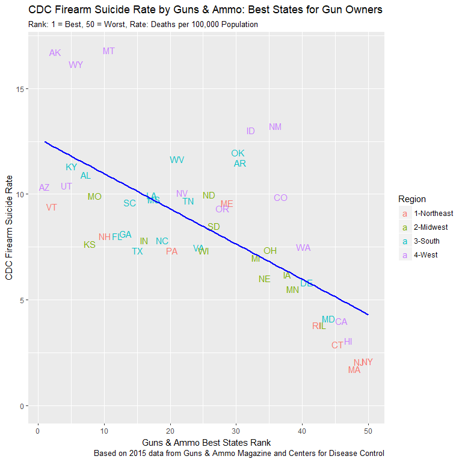
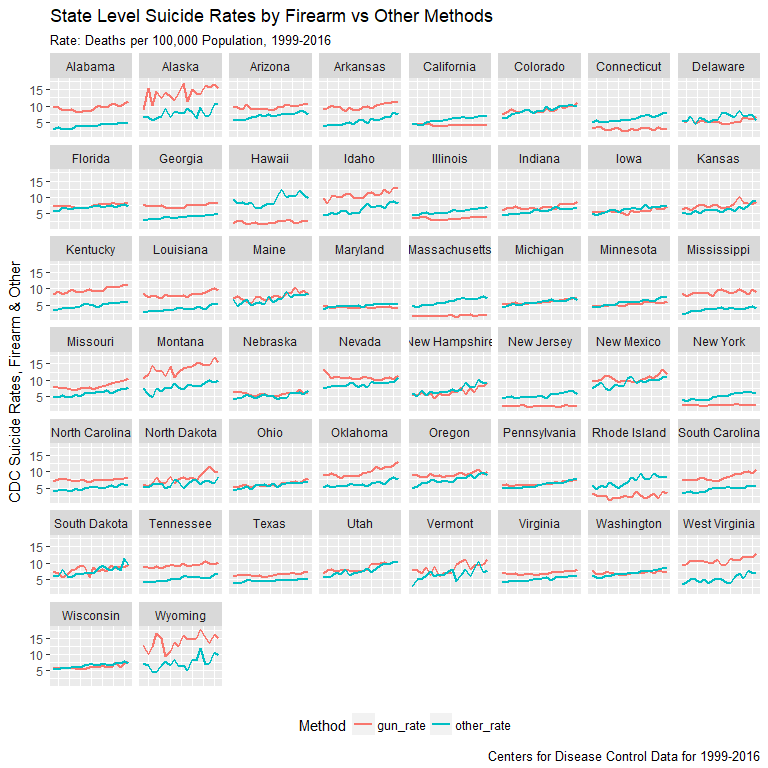
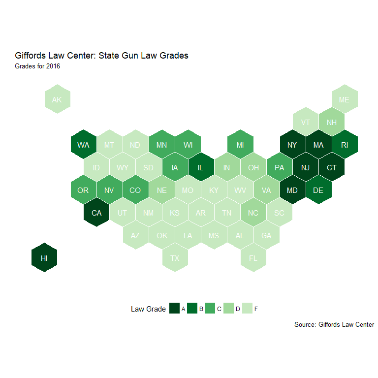

Firearm Suicide: The Hidden Side of Gun Violence
================================================

The Problem
-----------

**The individual most likely to kill a gun owner is …himself.** In the ongoing discussions of mass shootings and gun regulation, few address this less newsworthy fact. The CDC reports that 37,353 people were killed by firearms in 2016. Suicides, at 22,938, made up over 60% of those deaths. In 42 states an individual is more likely to kill themselves with a gun than to be shot dead by an assailant. The greatest risk to a gun owner is his own gun.

Best States for Gun Owners?
---------------------------

The 2015 Guns & Ammo rankings for ["Best States for Gun Owners"](http://www.gunsandammo.com/network-topics/culture-politics-network/best-states-for-gun-owners-2015/) bear an uncanny relationship to another data set, state level firearm suicide rates. Alaska, Wyoming and Montana rank 3rd, 6th and 11th respectively in the Guns & Ammo rankings. They also boast, by far, the highest firearm suicide rates (FSR) in the country. Guns & Ammo ranks Massachusetts, New Jersey and New York at 48, 49 and 50. These three states post the lowest FSR levels in the nation. In 2015, the FSR for Massachusetts was approximately ten times lower than the rate for Montana. This equated to 118 gun suicides in Massachusetts compared to 174 in Montana, with a population nearly seven times smaller. In addition, Massachusetts, a highly urbanized northeastern state, also registered a lower firearm *homicide* rate. By these measures, it is hard to determine what is meant by "The Best States for Gun Owners".

Abstract
--------

This project will explore the often overlooked issue of firearm suicide in the United States. The analysis will include an overall picture of the degree and distribution of firearm suicides and an investigation of the key state-level variables of gun ownership rates and gun control legislation. Linear regression models will be developed to test the relationship between ownership levels, gun law categories and state firearm suicide rates. Finally, specific classes of gun laws will be evaulated to determine their potential effect in reducing firearm suicide deaths.

The Data
--------

The [Centers for Disease Control and Prevention](https://wonder.cdc.gov/) provides the state-level firearm homicide and suicides rates as well as overall suicide rates annually for the period of 1999 to 2016. Gun law grades and limited state gun law and gun death data comes from the [Giffords Law Center](http://lawcenter.giffords.org/) for 2014 to 2016. Highly detailed annual gun law data for 1999 to 2016 was accessed at the Boston University School of Public Health [State Firearm Law database](https://www.statefirearmlaws.org/index.html). State level gun ownership data is exceedingly rare. This analysis was developed utilizing 2013 gun ownership survey results published in the journal [Injury Prevention](http://injuryprevention.bmj.com/content/22/3/216) for a paper by Bindu Kalesan et al., titled *Gun Ownership and Social Gun Culture*.

Data Preparation
----------------

### Data Import and Clean-Up of Variable Names and Types

During data import, all variable names were converted to lower case and spaces were replaced with underscores. Variable names were shortened where possible and shared variable names were standardized to facilitate the table joins. Other names had to be made more distinct to accommodate planned table merges. In addition, certain variables had to be converted from character to integer or numerical types. All imported files were converted to data frames with names that clearly indicated the nature of the data.

### Missing State Level CDC Suicide and Homicide Data

Several states were missing CDC homicide and suicide data for specific years. To assure the same 18 years of data for every state, both the suicide and homicide tables were joined to a complete CDC population data table. A consequent review of the state level data indicated that missing entries were likely not zero values. Further review of state level min, max and mean values suggested replacing the missing values with a state mean. After replacing the missing death count values, the related death rate NA’s were calculated where missing. Data was inspected for consistency and outliers, revealing only that the District of Columbia has an unusually high homicide rate, partially the result of a very small population base.

### Letter to Score and Reordered Rankings of Giffords Gun Law Grades

The Giffords gun law data included letter grades, but the analysis would be better served by also having numerical grades. The was addressed by joining the gun law data to a letter grade conversion table and then using a mutate command to populate an equivalent numerical gun law score in the gun law data table. A second issue arose from the gun death ranking variable running from low to high, with highest being the best ranking. This was the opposite of the gun law rankings where low scores were the best. It was decided to maintain the same low-high ranking logic across variables and convert the death rank scores accordingly.

### Collapsing Variables for Boston University State Gun Law Data

The state gun law data tracked back to 1991 and included 134 gun law variables. First, the data was filtered to include only the 1999-2016 timeframe covered by the CDC data. Second, and much more complicated, a law category data table was created with specific laws grouped into broader categories reducing the number of gun law variables from 134 to 14. The additional source state law code file facilitated this process, providing the category names and the related variables for the required mutate sequence. The original disaggregated file was retained for potential use at the machine learning phase of the capstone project.

### State Region and Subregion Census Data

Census Bureau data for state regions and sub-regions were imported to allow higher level data analysis investigating regional differences in gun ownership, gun laws and gun deaths. A unite command created region and subregion variables combining the code number and the name for simpler sorting of data legends when creating plots.

The source R-code file is available in a GitHub repository [here](https://github.com/datahoundz/Springboard_Data_Science/blob/master/01_data_import.R) and cleaned csv files are [here](https://github.com/datahoundz/Springboard_Data_Science/tree/master/data_cleaned).

Data Issues
-----------

### Excluding the District of Columbia

The District of Columbia was excluded from the anlaysis. As the lone geographical unit that is both a city and a state, its homicide rates were extremely high skewing any plots that included it. Inversely, DC's suicide rate is the lowest in the country with several years posting no suicide data at all. Also, several other data sources include only state level data without figures for DC. It is believed that these reasons justify its exclusion from this analysis.

### Gun Ownership Rates

Gun ownership data presents conflicting issues. The survey data acquired from the Kalesan Injury Prevention article covers only the single year of 2013. This impairs the ability to analyze shifts in state level gun ownership rates over time. Dr. Michael Siegel at the Boston University School of Public Health has developed a [proxy ownership metric](https://www.ncbi.nlm.nih.gov/pubmed/23956369) that has been calculated from 1980 to 2016. This data was acquired directly from Dr. Siegel and was integrated into the analysis. However, the proxy measurement utilizes the firearm suicide rate as a key element in its calculation. As the FSR is the dependent variable of interest in this study, this proxy measure was not utilized in the final analysis. Sharp discrepancies between Siegel's proxy measure and the Kalesan 2013 survey results, as illustrated in the plot below, strongly supports the need for better data on this critical variable.

### State Firearm Laws

The State Firearm Law database tracks 132 separate law variables over more than twenty years. For purposes of simplification, the 132 laws were grouped into the 14 larger categories outlined in the code file. Yet, the most frequent count for many of these categories remains zero as shown in this [linked map plot](https://raw.githubusercontent.com/datahoundz/Springboard_Data_Science/master/law_cat_map.png) (zero values in pale green). In these cases the measure is more binary than one of degree - does the state have *any* laws within a given category? This makes comaprisons between states more challenging, especially when combined with gun ownership data for only a single year.

Firearm Suicide Takes More Lives, and It's Getting Worse
--------------------------------------------------------

Firearm suicides not only consistently exceed firearm homicides, the divergence has been growing. Since 2008, the number of American's taking their lives with a gun has risen steadily with no indication of slowing down. Firearm homicides, by contrast, remained fairly steady and even posted several years of declines until the last few years.

### Firearm Suicide Nearly Twice as Frequent as Firearm Homicide

The average state firearm suicide rate (FSR) is nearly twice as high as the the average firearm homicide rate (FHR). In more rural states, the disparity is even greater. Only six states have firearm homicide rates that exceed their firearm suicide rates. Five of these six states have an FSR far below the national average.

### Rural and Mountain States Suffer Higher Overall Suicide Rates

Overall suicide rates display a strong negative correlation (-0.759) with a state's population density and also exhibit significant regional influences. States in the Northeast have much lower rates, while states in the Mountain subregion experience sharply higher levels than the rest of the country. This holds even allowing for population density as shown by the discrepancy between Mountain and Great Plains states at similar population densities.

### Suicide Methods and Trends Differ Widely by Subregion and State

Time series plots of suicides broken out by firearm/other indicate major regional differences. Coastal states exhibit much lower firearm rates and at levels that appear more steady compared to other suicide methods and other states. State level plots show these disparities existing within subregions as well.

More Gun Ownership, More Suicides
---------------------------------

### Gun Ownership Rates Vary by Region

The Northeast has the lowest gun ownership rates, while the South and West display much higher levels.

### Gun Ownership Correlates with OVERALL Suicide Rates

A positive correlation of 0.644 and an r2 of 0.415 exists between a state's overall suicide rate and it's level of household gun ownership. Regional effects are particularly pronounced in the Northeast and West.

### Mountain States Plagued by High Suicide Rates

Arizona is the only Mountain state to escape the "High" overall suicide classification. Higher population states appear to experience lower suicide levels generally.

### Higher Suicide Levels in Rural States Across Regions

Regional plots bear out the relationship between population density and overall suicide with rural states commanding the upper end of regional FSR levels.

More Gun Ownership, More Gun Suicides
-------------------------------------

### Strong Correlation Between Gun Ownership and Firearm Suicide

Gun ownership rates, unsurprisingly, display an even stronger relationship to the state's firearm suicide rate with a correlation of 0.748 and an r2 of 0.559. The map plot highlights regional variations in this effect as further displayed by the regional correlation plot.

### Clear Picture of FSR Issue in Mountain States

Utah is the only Mountain state to dodge the "High" FSR classification. Coastal states tend toward lower FSR levels, Alaska being an obvious exception.

### Regional Plots Highlight Rural/Urban Divide

Rural states rank higher for FSR across all four major regions, while highly urbanized states dominate the lower range of the plots.

### Gun Ownership Tiers Call Out Impact on FSR

High ownership states account for 12 ot the 13 states with the highest FSR levels. Low ownership states included 11 of the 13 lowest FSR states. Hawaii is almost certainly misrepresented as a high ownership state. Dr. Michael Siegel's proxy data suggests an average ownership rate of only 12.2% as compared to 45.1% from the Kalesan 2013 survey data.

### Firearms Contribute to Above Average *Overall* Suicide Rates

Since 1999, guns accounted for an average 58% of suicides in states with above average suicide rates and 48% of suicides in states with below average rates (average rates calculated annually).

    ## # A tibble: 2 x 4
    ##   abv_avg_rate     n deaths avg_gun_pct
    ##   <lgl>        <int>  <int>       <dbl>
    ## 1 FALSE          502 437229       0.486
    ## 2 TRUE           398 210903       0.583

Giffords Gun Law Grades Simplify the Picture
--------------------------------------------

### Giffords Law Grades Strong Indicator of Gun Deaths

A state's Giffords Law Grade not only works as a strong predictor of both overall gun death rank and firearm suicide rates, it even helps to predict a state's overall suicide rate. This provides additional support to the hypothesis that easier availability of guns contributes to higher overall suicide rates.

### Giffords Rank Solid Predictor of FSR Levels

The regional plot reveals the strong relationship between the gun law rank and the FSR. The relationship holds steadily over the three-year period for which data was available. It also indicates the stability of each state's position in these rankings.

### Giffords "F" Associated with Above Average *Overall* Suicide Rate

Out of 50 states, 41 Abv Avg Suicide ratings were indicated correctly by Gifford F. Displayed data for 2016. Slightly lower accuracy in 2014 and 2015 at 38/50 each.

    ##           Abv_Average_Rate
    ## Giffords_F FALSE TRUE
    ##      FALSE    21    4
    ##      TRUE      5   20

### Giffords Grade Map Displays Prevalence of "F" Ratings

The map of Giffords Grades presents an almost shocking image of the prevalence of "F" grades across the United States. The South appears distinctly lacking in non-F states. The northern Mountain and Prairie states represent another pocket of light regulation. Grades of A and B are concentrated in the Northeast and West coast. 

### Overall Suicide Map Discloses Areas of Inversion

The New England/Mid-Atlantic region and the Northern Mountain/Plains exhibit a near mirror image of the Giffords Grade map. On the other hand, the South and Pacific Northwest evade the direct relationship. 

Strong Firearm Legislation, Lower Firearm Suicides
--------------------------------------------------

### Gun Regulation Varies Widely by Region and Within Regions

As the state level plots below indicate, both the number of gun laws and the trend, increasing or decreasing varies significantly across the country. Even within the highly regulated Northeast, the more rural states of Vermont Maine and New Hampshire have gun laws at levels similar to the South or Mountain West.

### Increased Gun Regulation Occuring Mostly on Coasts

Only twelve states, concentrated on the East and West coasts, have significantly increased the number of gun laws between 1999 and 2016. This compares to 18 states that decreased the number of laws during the same period.

### Strong Inverse Relation Between Regulation and Firearm Suicides

A strong inverse relationship exists between the number of state gun laws and the firearm suicide rate and this relationship is even more pronounced at regional levels.

### Regional Plot of Regulation Mirrors Ownership Rates

The distribution of regulation reflects the inverse of the pattern seen with ownership rates. Here gun legislation levels are higher in more urbanized states and lower in the rural areas.

### Reduced Gun Laws, Increased FSR Deaths

States that reduced their total number of gun laws saw their average FSR increase by 5X the level experienced by states that implemented 10 or more new gun laws (Large Increase).

### Select State Comparisons

By way of comparison, Missouri eliminated a net of 10 gun laws and saw its FSR rise by 3.0 per 100,000. California implemented 33 new gun laws and saw its FSR drop by 0.5 per 100,000. Adjusting for population, Missouri saw an estimated 176 more suicides in 2016 while California saved an estimated 183 lives. The equivalent numbers for New York and South Carolina are 39 lives saved and 151 additional suicides repsectively.

Preliminary Conclusions
-----------------------

Analysis to this point suggests some strong candidate variables for predicting a state's firearm suicide rate, several of which correlate with each other. These include region, gun ownership rates, the level of gun law restrictions and population density.

During the machine learning phase of the project, an effort will be made to focus more closely on regional distinctions. The analysis will also shift from the simple total number of laws to explore specific law categories and perhaps even individual laws.

The goal of this analysis is to explore firearm suicide; however, preliminary findings suggest that many of the candidate variables are reasonably strong predictors of overall suicide levels as well. This is to be expected as the FSR represents around half of the overall suicide rate. But it would be interesting to explore how specific classes of gun legislation or other actions might effectively reduce the overall rate, especially in states with disproprtionately high FSR levels.

Another area of interest raised is the disparity between suicide rates in the Mountain and Great Plains subregions, both of which are characterized by similarly low population densities. Additionally sharp differences between neighboring states, Indiana and Illinois for example, present opportunities for more focused investigation of states with similar population profiles.
